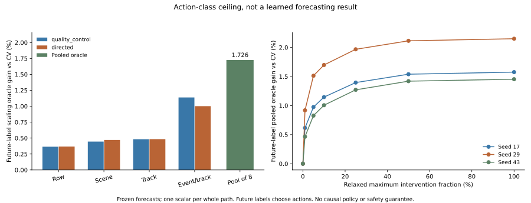

# Current Routing Candidates Have Limited Recoverable Gain

## Conclusion

The latest candidates are not merely hidden behind an overly conservative gate.
Even a future-informed selector over all eight fixed conditions per seed gains
only 1.62653% on the unchanged primary endpoint. Perfectly scaling each selected
correction along its baseline-to-candidate segment raises that to 1.72618%.

**These are retrospective oracle values, not learned model performance.** No
model, threshold, gate or deployment policy was trained in this diagnostic.
The earlier uncontrolled neural forecasts remain negative. A joint selector
restricted to these same trajectories/segments cannot create error reductions
outside this labeled-set action class. This is not an upper bound for arbitrary
candidate mixtures, different per-waypoint corrections, new predictors or M3W
in general. A synthetic counterexample explicitly checks that distinction.

| Frozen candidate condition | Perfect binary choice gain (%) | Perfect whole-path scaling gain (%) |
| --- | ---: | ---: |
| Quality / row | 0.316084 | 0.364534 |
| Quality / scene | 0.365001 | 0.445148 |
| Quality / track | 0.392458 | 0.482131 |
| Quality / event-track | 1.014971 | 1.138160 |
| Directed / row | 0.317688 | 0.367275 |
| Directed / scene | 0.385717 | 0.470784 |
| Directed / track | 0.398380 | 0.483540 |
| Directed / event-track | 0.901972 | 1.001320 |
| Pool of eight per seed | 1.626533 | 1.726175 |

The pooled scaling oracle's seed gains are 1.57542%, 2.14971% and 1.45339%.
ETH/Hotel/grouped-Zara means are 0.73625%, 3.06827% and 2.43880%. The descriptive
three-scene resampling interval is [0.73625%, 3.06827%]. It is not a confidence
interval for a deployable method or a new independent generalization claim.



## Computation and Bound Scope

For baseline B, fixed candidate N and target Y, define

```text
f_i(alpha) = mean_t || B_it + alpha*(N_it - B_it) - Y_it ||_2
0 <= alpha <= 1, with one scalar for the entire twelve-step path.
```

Coordinates are already normalized by the fixed past-only scale. The objective
is convex in alpha. A 36-step subgradient bisection brackets a minimizer; the
mean correction norm supplies a Lipschitz numerical envelope. Endpoints are
included so the feasible oracle never has to hurt a baseline-perfect row.
The maximum observed numerical loss-envelope width is 8.184e-10. Float64 and a
roundoff allowance are used, not a formal interval-arithmetic proof.

For the pool, the oracle chooses one of eight candidates and then its scalar.
For any policy confined to this action class, each realized row loss cannot be
smaller than the rowwise oracle loss. Multiplication by fixed nonnegative scene
weights and summation preserves that ordering. Joint compatibility constraints
only restrict this class. This elementary diagnostic observation is not claimed
as a new learning theorem, population-risk bound or physical safety certificate.

Coverage curves additionally relax per-query caps into ceiling-rounded counts
within each physical scene. Labels choose the rows with largest realized gain;
pairwise constraints and causal score uncertainty are deliberately ignored.
At a relaxed 10% cap, seed oracle gains are 1.14587%, 1.69833%, 1.00595%.
They cannot be presented as risk-controlled deployment curves.

## Where the Limitation Lies

- All 11,966 fit queries remain, including 365 exactly-static histories from
  31 recording-local IDs. No difficult sample was dropped.
- Those 365 rows account for 89.3667% of **equal-scene normalized CV error**.
  This is an error contribution under the approved scale/aggregation, not the
  fraction of people, scenes or physically important events. It differs from
  older pooled-row fractions because the aggregation differs.
- Static-to-movement support is 188 overlapping rows from 24 local IDs across
  two scenes. The pooled oracle still gains only 0.19903--0.43404% on this slice.
  Merely choosing among current directions and reducing their amplitude leaves
  almost all of that error uncorrected.
- Moving-history oracle gain is 8.56885--9.06514% conditionally, but the complete
  cohort remains primary. This slice must not replace the registered endpoint.
- Static-stay CV error is zero, so its percentage gain is undefined. Its oracle
  stays exactly at zero by knowing the labels; a causal gate cannot assume this.
- The perfect easy-row oracle also improves, but this gives no easy-preservation
  certificate for a learned gate. Earlier real models fail that requirement.

These observations do not prove that normalization alone causes the forecasting
failure. Prior per-recording native diagnostics were also negative. Changing the
primary retrospectively, or labeling the moving slice as a full result, would
not repair the evidence. The more useful next experiment must improve candidate
state-change predictions or their input support, rather than only selecting
among nearly-baseline paths.

## Verification and Provenance

`cached_verified`: the 72 frozen forecasts/checkpoints from the sampling study,
their original exact-inference replay, parent protocol and source-array hashes.
These include 54 previously trained new models and 18 reused controls; none is
retrained here.

`fresh_run`: all 72 candidate/fold/seed oracle computations, 2.71 seconds local
numerical analysis. A full second computation matches every private array
exactly. Completed resume verifies all receipts without new oracle minimization
or model updates and preserves the report. Independent SciPy minimization of
864 deterministic sampled real paths agrees to 1.777e-15 maximum loss difference.
This checks numerical implementation, not learnability or held-out validity.

Twenty-five focused tests pass, including seven new oracle tests. The full
legacy suite was not rerun. Original labels, predictions, checkpoints and the
primary task are unchanged. No development/calibration/confirmation role was
opened. All per-row labels/alphas remain private diagnostic artifacts, never
feature-store or inference inputs. No Stage5C, SMC, metric/seconds, foundation,
true-3D, deployment or submission-readiness claim follows.

## Research Decision

Do not spend another routing grid on this frozen pool. The useful bottleneck is
candidate prediction, especially transferable onset/direction information with
independent state-change support. Prospective source expansion still needs its
separate role and sampling admission; it is not silently approved by this
diagnostic. Existing sealed roles and the main 8-to-12 endpoint remain fixed.

This complements established regression-deferral work rather than creating a
new deferral problem. Mao et al. already study fixed-predictor, multi-expert
regression routing under bounded-loss assumptions. Their consistency results
do not automatically transfer to unbounded normalized ADE, historical exposure
or our structured constraints. [Published paper](https://proceedings.mlr.press/v235/mao24d.html),
[original Section 4](https://arxiv.org/html/2403.19494v1#S4).

```bash
.venv-pytorch/bin/python scripts/run_m3w_candidate_headroom.py --registration configs/m3w_candidate_headroom.json
.venv-pytorch/bin/python scripts/run_m3w_candidate_headroom.py --registration configs/m3w_candidate_headroom.json --verify
.venv-pytorch/bin/python scripts/verify_m3w_candidate_headroom.py
.venv-pytorch/bin/python scripts/plot_m3w_candidate_headroom.py
```

Commands require the private, hash-bound original inputs and predictions; these
are not included in a public clone. [Full metrics](report.json),
[numerical replay](replay.json), [independent check](independent_verification.json),
[error decomposition](error_decomposition.json).
