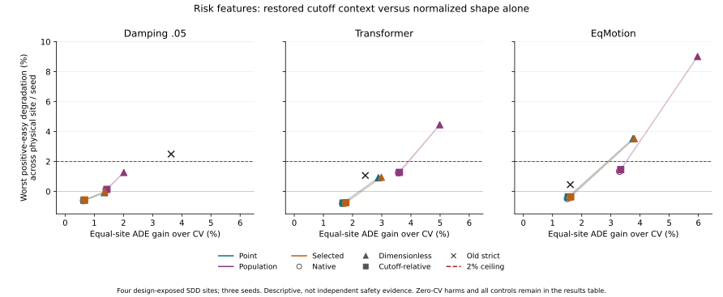

# Cutoff Context Repairs Part of the Risk Tradeoff, Not Deployment

## Material Passport

- Run date: 2026-09-24; source-only development experiment.
- Fresh: 36 six-output risk forests, fixed decisions and aggregate readout.
- Cached and verified: 72 matched control heads, predictors, forecasts and targets.
- Not run: new neural forecast training, independent calibration, external outcome
  evaluation, model/threshold selection or deployment.
- Protocol: SDD obs8/pred12 native annotation steps, stride12, annotation pixels.
  This is not the historical raw t50 experiment or a metric/seconds claim.
- Evidence: [analysis](analysis.json), [all 39 controls](results.md),
  [losses](training_losses.md), [separate checks](separate_checks.json),
  [post-readout harms](postreadout_diagnostics.json).

## Answer to the Registered Question

Restoring scale relative to the frozen easy cutoff substantially reduces the
easy-case degradation produced by the preceding shape-only dimensionless head.
It also sacrifices much of that head's average gain. The new results lie close
to the matched native-feature control, not on a clearly superior frontier.
This supports retaining scale context for a fixed native-error target; it does
not establish amplitude loss as the sole failure cause or a novel world-model
capability. No deployable winner is selected.

The registered population rule gives the following equal-physical-site mean
gains over constant velocity. Easy degradation is the worst site/seed among
positive-CV easy cases. Zero-CV harms are separately counted, including repeated
windows across seeds, rather than omitted from a percentage denominator.

| Action | Representation | ADE gain % | Hard ADE gain % | Worst easy degradation % | Zero-CV harmed window/seed instances |
|---|---|---:|---:|---:|---:|
| Damping .05 | Native | 1.4011 | 1.3267 | 0.1155 | 0 |
| Damping .05 | Dimensionless | 2.0118 | 2.1321 | 1.2647 | 1 |
| Damping .05 | Cutoff-relative | 1.4322 | 1.3980 | 0.1351 | 0 |
| Transformer | Native | 3.5746 | 3.0447 | 1.2430 | 7 |
| Transformer | Dimensionless | 4.9881 | 5.2525 | 4.4503 | 5 |
| Transformer | Cutoff-relative | 3.6046 | 3.0823 | 1.2732 | 5 |
| EqMotion | Native | 3.2976 | 2.0286 | 1.3458 | 7 |
| EqMotion | Dimensionless | 5.9727 | 5.7961 | 9.0097 | 6 |
| EqMotion | Cutoff-relative | 3.3370 | 2.0532 | 1.4580 | 6 |

All new rules satisfy the observed positive-easy average ceiling in this readout,
but that is not the same as no individual harm, zero-CV preservation or population
safety. The unselected agents' estimated denominator still subsidizes the
population rule. Conditional net benefit can still mask positive harm within a
sample. Unknown and incomplete future outcomes are retained, not certified safe.

## Matched Contrasts and Uncertainty

Cutoff-relative minus native population ADE gain is only +0.0300 percentage
points for Transformer, with nominal paired-site CI [-0.0260, 0.0996], and
+0.0394 pp for EqMotion, CI [-0.0122, 0.0910]. Neither establishes superiority
over the matched native control.

Compared with dimensionless population, the new rule loses 1.3835 pp for
Transformer, CI [-2.0599, -0.4722], and 2.6357 pp for EqMotion, CI
[-5.4710, -0.7708]. Average positive-easy gain improves by 1.7144 and 3.8853 pp,
respectively. This is a measured utility/protection tradeoff, not a free gain.

Compared with old strict, Transformer population is +1.1677 pp with CI
[-0.6723, 3.0078]. EqMotion is +1.7277 pp with CI [0.5878, 3.0429], but worsens
easy-case performance and retains zero-CV harms. That favorable development
contrast cannot be promoted while the safety and independent-evidence gaps remain.

Every interval uses 3000 paired resamples of four already design-exposed physical
sites after averaging the three seeds. These are nominal conditional development
intervals, not independent confirmation or multiplicity-adjusted discovery.
All 27 registered rule/action/comparator contrasts, each with all/hard/easy
subsets, remain in the results. No overlapping-window independence claim is made.

## What Improved and What Failed

**Risk-target estimation partly recovers.** Transformer held-source easy-harm
fraction MSE falls from 0.0797787 under dimensionless inputs to 0.0681777; native
is 0.0681125. EqMotion falls from 0.0551922 to 0.0540258; native is 0.0540426.
Easy-probability MSE similarly returns close to native. These are equal-fold
descriptive errors on complete-label source rows, not independent calibration.

**Restrictive policies do not solve the problem.** Cutoff-selected Transformer
ADE gain is 1.7718%, below old strict's 2.4368%, with one zero-CV harm. EqMotion
cutoff-selected gives 1.6237%, near old strict's 1.6093%, and zero observed
zero-CV harms; this does not prove a stable advantage. The previous dimensionless
selected Transformer signal is retained, not silently replaced or promoted.

**Zero-CV harm is real rather than roundoff.** Population Transformer harms two
unique hyang windows, five window/seed instances, with ADE 1.4141--2.7050 annotation
pixels. EqMotion harms three unique windows in coupa/hyang, six instances, with
ADE 3.0648--6.1752 pixels. Transformer point and selected rules both harm the same
one hyang window at seed29, ADE 1.8527 pixels. Each seed has 11566 observed zero-CV
windows. These are post-readout descriptive checks, not a new tuned exclusion rule.

**Unsupported futures still matter.** Population Transformer selects 448--498
unknown-future windows per seed and 5630--6361 incomplete windows, including
unknowns. EqMotion selects 255--286 unknown and 3654--4064 incomplete. Their true
unobserved errors cannot be declared safe. Full-grid partial-future bounds remain
in the original aggregate; no future-based filtering is introduced.

**Representation is unit-consistent in the tested scope.** All 72 fixed metadata
unit probes at .01 and 100 preserve features and risk predictions exactly when
scale, disagreement and the source cutoff convert together. No new prefix adapter
is mixed in. This is not full-controller or end-to-end cross-dataset invariance.
The reparameterization has no extra information relative to the native head;
its distinction is explained in [method scope](method_scope.md).

## Verification and Remaining Work

All 36 fresh fits have 128 trees and the unchanged 768000 source draws, with no
unknown-label training draws. All 175756 windows remain. The 30 old summary rows
reproduce exactly. Separate arithmetic has checked 36 matched fits, 376776
original-unit query constraints and 180 scene reductions. Five solver proposals
fail the final strict original-unit check and fall back to CV; none relaxes the
budget. They are not reported as optimal solutions. Earlier failed exact-count
controls remain failures, so this is not an equal-intervention-rate superiority
claim. Full decision-array/record and aggregate replays are exact; all required
processes finished. [Execution timing and coverage](execution_notes.md) distinguish
training, source verification, numerical checks and scientific limitations.

The next method problem is conditional harm/support control, not another larger
neural backbone or a looser easy threshold. The source-only accounting controls
must distinguish benefit-credit effects from actual risk-estimation error while
preserving the full past-eligible population and reporting unseen future support.
Meaningful predictor-matched intervention comparisons and genuinely independent
calibration are still required before a stronger claim.

DroneCrowd remains closed to confirmation outcomes. IMPTC remains quarantined;
its input engineering probes are not forecasting evidence. CREATE's most recent
saved access check failed authentication and current remote state is unknown;
this complete experiment ran locally. Deployment is unchanged, Stage5C/SMC stay
off, and the project is not submission-ready on the strength of this result.
