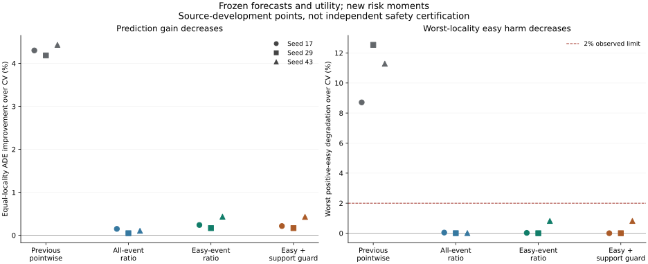

# Conditional Event-Risk: Protection Improves, Utility Remains Insufficient

## Decision

The registered experiment completed: 18 ridge and 18 real Torch risk heads,
36,000 neural updates and all 24 predeclared policy views. Event-specific risk
learning has a matched-control signal, but does not establish a competitive,
calibrated or deployable neural policy. No head, seed or threshold is promoted.
The overall M3W research goal remains unfinished.

This is source-development evidence on European Squares image-pixel detector
tracks, with eight observations and twelve predictions at raw stride 12. It is
not SDD t50, metric/seconds prediction, verified online sensor data, human gold,
true 3D, foundation-model success or independent confirmation. Stage5C and SMC
remain disabled.

## What Changed

The original 18 forecasters and CV-reference utility heads are cached_verified
and frozen. Newly fitted heads predict baseline-error and added-harm moments
either over all supported samples or over the positive-easy event. Both arms
use identical sampled training rows, features, architecture and budget. A
separate source-support control abstains on a fold with no fitting zero-CV
events. The event definition uses fitting-only cutoffs; held future labels
never enter the policy. See [registration.md](registration.md).

The full pointwise population retains 318,969 targets: 311,922 have some future
labels, 7,047 have none, and 240,269 support final-step FDE. Missing labels are
not zero errors. The complete-future sensitivity has 193,705 targets and does
not replace the original population. Joint controls use only the fixed
1,152-query / 6,116-target pilot.

## Full Pointwise Neural Results

These are the easy-event heads without the additional source-support guard.
All three seeds are reported; none is selected as a winner. Gains average
locality-specific percentage changes with equal locality weight.

| Seed | ADE gain vs CV, conditional 95% CI | Worst-locality positive-easy degradation | Zero-CV harmed | Intervention rate | ADE gain vs fixed damping 0.97 |
|---|---|---:|---:|---:|---:|
| 17 | 0.2382% [0.1250%, 0.3595%] | 0.0225% | 0 / 4 | 1.2456% | -4.1289% |
| 29 | 0.1663% [0.0618%, 0.2875%] | 0.0000% | 0 / 4 | 0.2944% | -4.2026% |
| 43 | 0.4310% [0.1468%, 0.7766%] | 0.8170% | 0 / 4 | 0.5345% | -3.9205% |

The observed pointwise easy and zero-event checks pass, unlike the preceding
CV-reference policy. But that policy had 4.18--4.43% ADE gain over CV; most of
its utility has been lost. Every new easy-neural damping-relative interval is
negative. Fixed damping itself fails the worst-locality easy rule, so it is a
strong accuracy control, not a deployable safety winner.

With the source-support guard, easy-neural ADE gains are 0.2141%, 0.1661% and
0.4275%; intervention rates are 0.5502%, 0.2913% and 0.5333%. Both event arms
lose coverage under that guard. For this neural head, unguarded zero-CV harm
was already zero; the guard does not demonstrate an additional learned safety
capability.

Matched easy-versus-all event contrasts with the guard are positive for every
seed: 0.1981% [0.0877%, 0.3204%], 0.1483% [0.0510%, 0.2651%], and 0.4109%
[0.1333%, 0.7554%]. Without the guard, seed 17's contrast includes zero. This
supports further study of event-specific targets, not a claim that the whole
policy improves on the previous model. Direct contrasts are not differences
between separately averaged percentages.

The all-event ridge control gives 0.4801--0.6062% pointwise ADE gain while
passing the observed easy and zero-event checks. Neural risk-head complexity
is therefore not necessary for the largest gain in this fixed pointwise study.
Easy-event ridge without the guard harms one zero-CV case in seeds 17 and 29.
All controls and negative results remain in [results.md](results.md).

## Joint Decisions and Safety Limits

Easy-neural joint ADE gains over CV are 1.2301%, 0.7572% and 1.1436%, but
worst-locality easy degradation is 1.0770%, 2.1034% and 2.0391%. Two seeds
fail the unchanged 2% limit. The guarded view gives 0.8377%, 0.7095% and
1.0775% gains with observed easy preservation, but there are no zero-CV cases
in this pilot. Empty event support cannot validate protection.

Matched-count joint contributions are zero, tiny or undefined, rather than a
stable advantage over independent decisions. Undefined contrasts retain the
declared locality and are not turned into zeros. The useful comparison is the
same population and intervention count, not full-cohort versus pilot gains.

## Verification and Remaining Gaps

Complete metric reconstruction passes. Fresh checkpoint inference reproduces
4,096 sampled predictions for every one of 36 heads exactly. Accounting verifies
15 unchanged reference views, nine matched all/easy sampler pairs and 72 decision
receipts. These are engineering and reproducibility checks, not safety proof.

All intervals use 3,000 locality resamples conditional on shared source data and
fitted models. Twelve training localities remain development-exposed; reserved
selection, calibration and confirmation roles, including DroneCrowd, stay closed.
Only four zero-CV cases exist, all in one locality, each with two observed future
labels and no final endpoint. A support guard is not a calibrated risk bound.

Ten singleton solver-failure views were traced to extremely small predicted
denominators. A separate exact-feasibility pruning helper solves all ten with
the same fallback decisions and no relaxed budget. Original V1 metrics and
solver failures are retained; this is not a full repaired-policy rerun.

Next, compare risk-protected simple motion/damping predictions against the
neural predictor under the same targets, support and decision budget. Also
diagnose event-moment reliability and the four-site cost-target producer versus
eight-site held-data producer shift. Do not open reserved outcomes merely to
choose a better-looking source result.

[Failure analysis](failure_analysis.md), [losses](training_losses.md),
[method positioning](method_positioning.md), [execution](execution_notes.md),
[Chinese operation guide](operation_zh.md).

