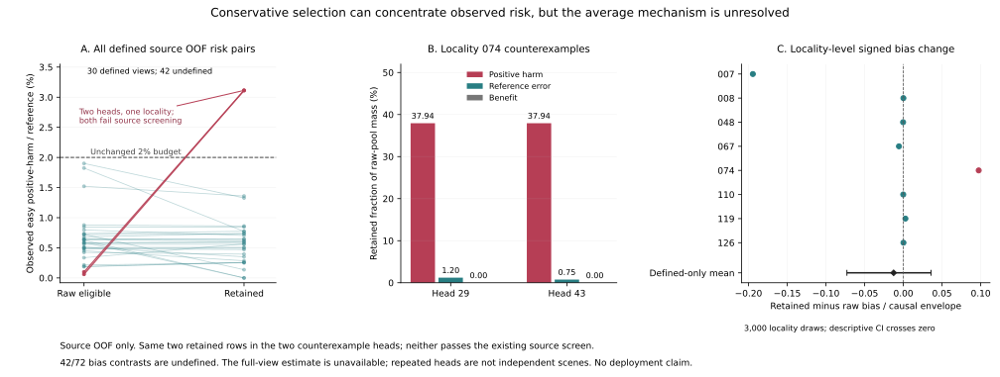

# Why Fewer Interventions Need Not Reduce Selected Risk

## Evidence Scope

This appendix reports completed source accounting, not the pending full transfer
experiment. It is a diagnostic of already-frozen policies, not a new prediction
method or a positive deployment result. The72 source/head views reuse twelve
development-exposed localities and fixed producer/controller/fitting/outer-held
roles. Cost-head seeds17,29,43 share upstream seed43; they are not three complete
independent neural-predictor training runs. Independent selection, calibration
and confirmation roles remain closed.

All inputs follow the existing obs8/pred12, stride12 raw-frame contract. Errors
are image-local and labels detector-silver. Neither elapsed seconds, metric
geometry, physical safety, human-gold annotation, true3D nor foundation-model
performance is established. Historical SDD/raw-frame t+50 scores are not pooled
with these European source results.

## Risk Accounting

Let A be a policy's raw eligible set, K the retained set after component
adjustment, and D=A\K the removed set. All three are determined by frozen causal
inputs and predictions before loading outcome labels. On the common known-label
rows, let r_i be the reference forecast error and n_i the candidate error. Let
e_i be the outcome-defined positive-easy indicator, used only for evaluation.
The observed easy positive-harm and reference masses are

```text
H(S) = sum_{i in S, known} e_i max(n_i - r_i, 0)
R(S) = sum_{i in S, known} e_i r_i
risk(S) = H(S) / R(S), when R(S) > 0.
```

Unknown outcomes are recorded separately; they are not zero-cost trajectories.
An empty denominator remains undefined. Neither e_i nor future-label validity
is an inference input. The existing empirical contract uses a2% selected
positive-harm/reference ratio, not a2% whole-population ADE degradation rule.
The two metrics cannot certify each other.

When R(A) and R(K) are positive, direct algebra gives

```text
risk(K) - risk(A)
 = [H(K) R(D) - H(D) R(K)] / [R(K) R(A)].
```

Thus a smaller selected set can have larger realized risk if removal reduces
reference-error mass faster than positive-harm mass. The identity also covers
R(D)=0; no removed-set risk ratio needs to be invented. This is elementary
accounting, not new theory, a population-risk bound, or a distribution-shift
guarantee. It is checked directly against the stored native cost sums.

## Source Counterexamples



**Figure.** (A) All30 defined source-OOF joint risk pairs, with42 additional views
explicitly undefined. (B) Two violating views from one locality retain37.94% of
positive-harm mass but only1.20% and0.75% of reference-error mass, respectively.
(C) Locality-averaged changes in the predeclared envelope-normalized signed
bias; the defined-only mean and nominal95% interval do not establish a positive
average change. Repeated heads and overlapping windows are not independent
scenes. Both counterexample views fail the existing whole-source screen.

For locality074 in the single1/controller2 context, head29 changes from0.098800%
raw risk to3.112915% retained risk, while predicting1.595222% for that retained
pool. Head43 changes from0.061763% to the same3.112915%, while predicting1.491847%.
Both retain the same two known rows and no beneficial mass. These are two head
views of one source context, not two independent replications.

Recording106 already exceeds2% within its own raw pool; recording118 remains
below2% after selection. The pooled increase therefore includes a change in
between-recording composition. It would be incorrect to claim that every
recording became newly unsafe, or to identify a causal domain-shift effect from
this source-only observation.

## Counterexamples Are Not a Population Result

The primary signed-bias diagnostic compares retained and raw pools using the
same adjusted predictions, normalized by causal forecast-disagreement mass.
For joint source OOF,42/72 contrasts are undefined, leaving the strict all-view
mean unestimated. The descriptive analysis of30 defined views averages within
eight contributing localities before3000 bootstrap draws. Its mean is-0.0124760
with interval[-0.0728833,+0.0358197], in normalized-bias units, not percentage
ADE gain. It does not show universally increased optimism after selection.

Full-source resubstitution has no observed easy-risk violation among30 defined
joint views. That result evaluates coefficients on their fitting data and is
not a substitute for source OOF or independent confirmation. Moreover, the two
source OOF counterexamples are already rejected by the old source screen. They
cannot explain the surviving screened transfer failures without the separate,
complete source-to-target accounting. That experiment remains pending on CREATE
at the preparation of this appendix.

## Relation to Existing Work and Next Test

Selective calibration already studies reliability conditional on acceptance,
rather than accuracy alone. Fisch, Jaakkola and Barzilay train a selector for
accepted-prediction calibration with coverage constraints and assess robustness
under shifts. Their classification setting does not supply a guarantee for our
partially observed trajectory-cost ratio. Conditioning calibration on selection
is therefore not our novelty claim. [Primary paper, introduction and sections3-4.1](https://arxiv.org/html/2208.12084v2).

The immediate research implication is narrower: raw-pool component margins
cannot be assumed to certify a changed selected pool. Before fitting another
policy, the complete transfer diagnostic must separate selection/composition,
OOF-to-refit differences, support shortages and locality changes. A proposed
selection-aware repair must also differ meaningfully from the already-negative
subset-supervision and decision-aware checkpoint experiments. It requires a
separate source-only registration and evaluation of the actual final policy,
not another threshold chosen from the motivating transfer failures.

No new deployment, Stage5C execution or SMC follows from this appendix.

## Reproduction and Provenance

The source figure uses only the72 hash-verified source group artifacts and the
completed source replay receipt. Its72 plotting rows, missingness counts and
bootstrap settings are exported in [source_figure_data.json](source_figure_data.json).
The SVG and data bytes match the independently stored CREATE copies recorded in
[source_figure_receipt.json](source_figure_receipt.json). That receipt's
local_artifacts_written=false describes the original memory-only render and
remote storage operation; the lightweight SVG/data were subsequently copied
back with matching hashes. No PNG cache was copied into the repository.

```sh
PYTHONDONTWRITEBYTECODE=1 .venv-pytorch/bin/python -m pytest tests/test_m3w_selected_pool_source_figure.py -q
PYTHONDONTWRITEBYTECODE=1 .venv-pytorch/bin/python scripts/plot_m3w_selected_pool_source.py --memory-only
```

Normal on-disk plotting retains the original disk-reserve guard. Memory-only
rendering writes no local figure/data files. Five new source-figure tests pass;
the unchanged accounting/transport/collector code has38 earlier scoped passes.
Neither proves the research hypothesis or completion of the full legacy suite.
