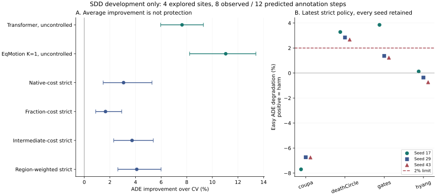

# Learning When to Intervene in Multi-Agent Motion Forecasting: Gains, Conditional Harm, and the Limits of Conservative Selection

Evidence-bearing English draft, 22 September 2026. This is a coherent account of
completed development experiments, not a submission-ready paper or independent
confirmation. The main research objective remains a reliable baseline-relative
intervention method; the experiments below do not establish that objective.
The [chronological research draft](../paper_working_draft.md) preserves earlier
protocols and negative results. This draft does not pool their incompatible scores.

## Abstract

A neural motion predictor can improve average accuracy while damaging trajectories
that a simple causal baseline predicts well. We investigate whether learning the
benefit and harm of replacing a baseline forecast can preserve these easy cases
without discarding useful neural predictions. In an offline annotated-history
task with eight observed and twelve predicted steps, we compare neural predictors,
matched continuous-cost objectives, and conservative intervention policies on four
previously explored Stanford Drone Dataset sites. Three-seed development results
show mean site-relative ADE improvements of 7.63% for a Transformer and 11.04% for
an adapted EqMotion predictor, but substantial easy-case degradation for both.
A fixed decision-region weighting repair raises conservative-policy improvement
from 3.73% to 4.10%, with a paired conditional site-bootstrap contrast of 0.37
percentage points [0.17, 0.60]. This improvement does not satisfy protection:
easy error increases by 2.93% and 2.15% in two sites, exceeding the 2% criterion.
At a matched intervention count, the repair slightly worsens the preceding
policy. Harm remains underestimated on newly selected held-site examples, and
a separate matched joint-decision study finds no coupling benefit. We therefore
identify conditional risk estimation and independent calibration as unresolved
requirements, rather than claim a safe world model. All errors use annotation
pixels; the study establishes neither physical safety nor independent generalization.

## 1. Introduction

Motion forecasting is often evaluated by average error. For deployment alongside
a strong existing predictor, however, average improvement is only part of the
decision. Replacing an accurate baseline can create errors where none existed,
and selecting forecasts independently can produce an incoherent multi-agent
configuration. The relevant question is not simply whether a neural network can
predict motion, but when its prediction should be used.

We study baseline-relative intervention. A fixed causal constant-velocity
predictor supplies a reference path; a neural predictor supplies an alternative.
A learned decision rule estimates the positive benefit and positive harm of
switching. Conservative policies can retain the reference when the estimated
tradeoff is unfavorable. This is a two-predictor routing problem, not a new
definition of a generative world model.

Our intended methodological hypothesis is that relative-cost supervision,
scene-aware composition, and independently calibrated fallback can produce
reliable gains. The completed studies test parts of that hypothesis and retain
their negative outcomes. They establish three narrower findings: native-error
training improves a matched predictor; global cost-regression improvement need
not improve selection-conditioned protection; and joint optimization adds no
forecasting benefit in the tested conservative candidate pool. They do not yet
establish a novel, reliably protected intervention method.

The contribution of this draft is an explicit experimental account of that gap.
It distinguishes model fitting from conditional reliability, mean performance
from worst-site protection, and computational replay from independent evidence.
We report the latest failed protection repair alongside successful average-error
comparisons, rather than selecting only favorable models, sites, or seeds.

## 2. Related Work and Method Boundary

**Motion prediction.** EqMotion combines equivariant motion prediction with
invariant interaction reasoning [1]. We use an adapted, fixed-output-head author
core as a strong comparator. This is not a reproduction of its published
best-of-many-samples benchmark, nor an isolated test of equivariance. JFP explicitly
models pairwise dependencies among future trajectories [2]. Consequently, adding
pairwise compatibility or a joint optimizer cannot by itself establish novelty.

**Prediction routing and abstention.** Regression with multi-expert deferral
includes a two-stage setting with a fixed predictor and a learned deferral function
[3]. Our routing problem overlaps directly with that setting. Separating positive
benefit and harm changes the supervision and diagnostic questions; it does not
make predictor selection a new problem. Selective regression can also worsen
subgroup performance as coverage is reduced [4]. Here, fallback still produces
a forecast, unlike abstention, and the easy subset is defined by evaluation
outcomes rather than a demographic attribute. Those distinctions prevent direct
transfer of that work's fairness claims to this experiment.

**Risk calibration.** Learn then Test formalizes policy calibration through
multiple testing under a specified sampling model [5]. Our current threshold
is a fixed engineering rule, not a calibrated risk certificate. The four sites
used here have already influenced research design, and dependent windows cannot
be counted as independent calibration observations. Neither a positive bootstrap
interval nor a small predicted harm budget supplies the missing guarantee.

These comparisons motivate the controls below. They do not establish that no
equivalent method exists. A broader related-work review and a positive controlled
method result remain necessary before claiming methodological novelty.

## 3. Task, Data, and Evidence Roles

### 3.1 Observation contract

The current task uses eight observed and twelve predicted annotation steps,
sampled at SDD stride 12. Inputs include observed target and neighbor history,
causal motion descriptors, masks, and frozen candidate rollouts. Explicit future
coordinates and future-validity masks are available only for loss and evaluation.
They do not determine current agent membership, inference normalization, or goals.
Raw-frame t+50 is a separate task and is not pooled into the tables below.

The observation mode is **offline annotated history**. Dataset-provided historical
positions may have been interpolated with later annotation controls. Accessing
only past-indexed rows therefore does not prove sensor-time availability. This
limitation is distinct from explicit future-target leakage in the implementation.
Verified frame-to-time and geometric calibration are absent; all quantitative
claims here are annotation-pixel claims, not seconds or meters.

### 3.2 Population and fitted-artifact lineage

The source population drawn from SDD [6] contains 175,756 past-eligible pedestrian queries from 33
recordings in four physical sites: coupa, deathCircle, gates, and hyang. All four
have informed model development. They are not untouched test sites. Of these
queries, 172,957 support observed-point ADE, 144,010 support the final-step FDE,
and 143,918 have a complete future grid. A missing future is unknown, not zero
error; inference eligibility does not depend on these counts.

For an outer-held site O, the evaluated predictor for that view excludes O. A cost
head trained on a row from another site R uses predictions from a producer that
excludes both O and R. All learned preprocessing follows the same fitting
boundary. This prevents a held site's labels from entering its fitted ancestors.
It does not undo the researcher's previous inspection of development results.

Further separation is needed for calibration. Removing a prospective calibration
site C from the head's training rows is insufficient if the predictors producing
other retained targets were trained on C. The completed provenance audit rejects
all 36 proposed source-internal reuses for this reason. A strict repair would
require triple-excluded producers; it has not been run or authorized as a new
calibration design. Independent calibration and final confirmation remain absent.

### 3.3 Metrics and uncertainty

For each query, ADE averages Euclidean error over available requested future
positions; FDE uses the final requested position only if observed. Let E_s(M)
denote mean ADE for model M in site s on common supported outcomes. The primary
summary is

```text
G(M; B) = (100 / |S|) sum_s [1 - E_s(M) / E_s(B)].
```

Errors are averaged over seeds 17, 29, and 43 before site gains are computed;
forecast trajectories are not averaged into an ensemble. Sites receive equal
weight, not weight proportional to their number of overlapping windows. Native
errors and tail summaries remain in the underlying reports. The native-error
protocol was adopted after diagnosing an earlier normalization problem; it is
post-hoc protocol development, not retrospective preregistration.

Hard and positive-easy slices use fitting-only CV-error quantiles (q75 and
positive-error q25) applied to evaluation outcomes. They are diagnostic labels,
never inference inputs. Easy degradation is the sign-reversed site-relative
gain; positive values indicate harm. The protection check requires degradation
no greater than 2% in every scene and seed. Complete exactly CV-correct futures
are assessed separately in absolute error; percentages at zero reference error
are undefined, and no denominator epsilon is used to hide harm.

Reported intervals reuse 3,000 paired physical-site bootstrap resamples from the
recorded experiments. Four explored sites remain four sites, not 3,000 independent
replications. These conditional development intervals neither account for all
adaptive research decisions nor establish generalization to unobserved sites.

## 4. Baseline-Relative Intervention

### 4.1 Benefit, harm, and forecast disagreement

Let B and N be the baseline and neural trajectories, and Y the future. On a
complete common grid, define benefit b, harm h, and known forecast disagreement D:

```text
b = max(ADE(B,Y) - ADE(N,Y), 0)
h = max(ADE(N,Y) - ADE(B,Y), 0)
D = mean_t ||N_t - B_t||_2.
```

The reverse triangle inequality gives b+h <= D. This is an elementary bound,
not a new theorem or proof of safety. It motivates constraining the cost head's
outputs to the triangle of nonnegative costs whose sum is at most D. If the
forecasts coincide, both costs are exactly zero. A two-output neural head uses
positive latent scores u_b,u_h and outputs D*u/(1+u_b+u_h).

The head has 356 causal features, one width-128 hidden layer, and 45,954 trainable
parameters. It learns from complete, pair-excluded forecast outcomes. Unknown
supervision is not replaced with zero. Feature standardization and numerical
cost scaling are fitted on training data only. Predicted costs are continuous
errors, not calibrated probabilities.

### 4.2 Matched cost objectives and region weighting

Using the same scaled costs, architecture, initialization, sampler, and update
budget, we compare squared error weighted by 1, 1/D, and 1/D^2. We call these
native-cost, intermediate-cost, and fraction-cost objectives. At D=0 the
implementation uses a denominator of one, with the bounded output and true costs
both zero. This numerical branch does not modify an evaluation denominator.

The latest repair holds the intermediate objective fixed and weights rows selected
by the preceding frozen strict policy four times more heavily. We normalize
weights under the unchanged training sampler. Both benefit and harm terms receive
that weight. The repair uses the preceding policy's **fitting** selection region;
it does not use held outcomes to define a new region. All heads receive 12,000
updates with batch size 256. The repair adds twelve fresh heads; earlier controls
are explicitly cached references, not new runs.

### 4.3 Fixed deployment-style rule and diagnostic controls

The strict rule permits a switch only when the last two observed positions differ,
D is positive, predicted benefit exceeds harm, and predicted harm is at most
one tenth of predicted benefit. Otherwise it keeps CV. This ratio is fixed
before each registered comparison; it is not a 2% easy-error guarantee.

Two controls separate accuracy from intervention volume. The net-gain rule drops
the harm-ratio restriction while retaining past support. The matched-count rule
selects the same number of queries as a frozen reference by estimated net gain.
The latter is a batch diagnostic, not an online safety policy; matching counts
does not match realized risk. No threshold is selected from the results below.

### 4.4 Joint-decision hypothesis

In a separate fixed-predictor experiment, we compare independent-agent selection,
unary geometry-aware selection, whole-scene selection, and joint binary selection.
The joint objective adds baseline-relative pairwise proximity penalties while
retaining the same forecast candidates, support, counts, and predicted-harm budget.
The geometry-aware unary control preserves single-agent geometric terms while
removing the non-additive interaction. This is the relevant coupling contrast;
comparison with a geometry-free policy alone would confound the mechanism.
Unknown context forecasts remain unsupported, not collision-free. The proximity
quantity is an annotation-coordinate proxy, not a physical collision measure.

## 5. Results

### 5.1 Strong predictors do not solve easy preservation

| Predictor or policy | ADE gain % | FDE gain % | Hard ADE gain % | Easy degradation % |
|---|---:|---:|---:|---:|
| Causal CV | 0.000 | 0.000 | 0.000 | 0.000 |
| Transformer, uncontrolled | 7.633 | 8.645 | 10.658 | 21.710 |
| EqMotion K=1, uncontrolled | 11.043 | 12.391 | 15.401 | 35.250 |
| EqMotion + native-cost strict | 3.067 | 3.341 | 4.305 | 2.500 |
| EqMotion + fraction-cost strict | 1.658 | 1.786 | 0.787 | -1.589 |
| EqMotion + intermediate-cost strict | 3.729 | 4.031 | 3.744 | -0.814 |
| EqMotion + region-weighted strict | 4.098 | 4.411 | 4.260 | -0.575 |
| EqMotion + region-weighted net-gain | 11.951 | 12.787 | 14.224 | 21.682 |

**Table 1.** Three-seed development comparisons against fixed CV. Positive easy
degradation is harmful. All gains are site-relative, not a pooled raw-pixel mean.
Predictor-family comparisons do not isolate the cost objective. Exact values,
conditional intervals, worst-site damage, and JSON source pointers are exported
in [tables.md](tables.md) and [main_table.csv](main_table.csv). Native ADE/FDE,
label support, and ADE p95/p99 for each method and site are in the 32-row
[site_metrics.csv](site_metrics.csv); these heterogeneous pixel errors are not
pooled across sites as one physical distance.

The native-loss Transformer improves average ADE over its matched old-loss
control; the direct relative-error contrast is 5.56% [3.34%, 7.78%]. This is a
relative reduction against the old model, not subtraction of their CV-relative
percentages. The stronger adapted EqMotion system improves CV-relative gain by
3.41 percentage points over Transformer [0.94, 6.07]. Their different sizes and
output wrappers preclude an isolated equivariance claim. Both fail protection.

### 5.2 Accuracy improves while the protection gate fails

The latest strict repair improves CV-relative ADE by 4.098%, conditional interval
[2.623%, 5.994%]. Its paired improvement over the preceding intermediate head is
0.36871 percentage points [0.17316, 0.60302]. Aggregate easy error improves 0.575%,
and no harm is observed on selected complete exactly CV-correct outcomes.

Those aggregate figures do not satisfy the required gate. Seed-average easy
degradation is 2.933% in deathCircle and 2.151% in gates. deathCircle fails in
all three seeds; gates fails in seed 17 (3.854%). No new model is deployed.
The apparently safer fraction-cost control is not retrospectively promoted
either: it lacks independent calibration and confirmation.



**Figure 1.** Left: recorded conditional 95% site-bootstrap intervals. Right:
all three seeds of the latest strict policy, with the unchanged 2% criterion.
The plotted sites are development-exposed. Improvement in the left panel cannot
override protection failures in the right panel.

### 5.3 Matched controls limit the mechanism claim

At a matched intervention count, region weighting is slightly worse than the
previous head: -0.04374 percentage points [-0.07376, -0.01372]. The positive
strict-rule contrast therefore does not establish improved ranking at equal
intervention volume. Removing the ratio gate recovers large mean gain but raises
easy degradation to 21.682% and harms 21 complete exact-CV query/seed instances.

The earlier matched-objective comparison is also incomplete as a contribution:
intermediate minus native gives 0.66173 points [-0.27228, 2.18556], whereas
intermediate minus fraction gives 2.07125 points [0.66261, 4.31900]. The first
interval includes zero, so the criterion requiring positive lower bounds for
both contrasts fails. The interval does not establish equivalence.

The separate joint-control experiment makes identical joint and unary-geometry
decisions on all 62,796 scene/seed queries. Its zero contrast is an exact empirical
null, not proof of population equivalence. Only 88 queries support a non-additive
opportunity; exhaustive evaluation of 12,783 candidate subsets confirms the
optimizer results. A designed proximity reduction does not establish forecasting
gain. This null concerns the specified fixed pool and weight, not every possible
interaction model.

### 5.4 Conditional optimism and missing outcomes

Region weighting improves cost MSE in the old fitting selection region for
11 of 12 heads, but mean harm is still underestimated in 11 of 12 newly selected
fitting views and all 12 newly selected held-site views. The training emphasis
helps its target region without making the new decision region reliable.
This supports selection-conditioned optimism as a failure diagnosis; it is not
proof that a particular calibration remedy will succeed.

The strict policy selects 29,668 query/seed instances. Of these, 423 lack an ADE
label and 4,194 have incomplete futures; the former are included in the latter.
These are repeated instances across seeds, not independent observations. Missing
outcomes prevent a full-grid protection conclusion even where observed harm is
zero. They are reported, not discarded from intervention counts.

## 6. Discussion and Limitations

The evidence distinguishes three problems. First, useful candidate forecasts
exist, so lack of average predictive capacity is not the sole obstacle. Second,
the cost head must be reliable on examples its own policy chooses, rather than
only on the training distribution as a whole. Third, support for independently
calibrating that reliability is currently inadequate. Increasing architecture
complexity or running another held-result threshold search would not resolve
the third problem.

The present experiments remain limited to four explored SDD sites with dependent
windows and incompletely observed futures. Three seeds address some optimization
variability, not dataset independence. Historical external successes obtained
under different, subsequently questioned lineage or selection protocols are not
pooled into this manuscript. External source intake remains incomplete; available
files and release train/test names do not establish independent physical sites.

Annotation provenance also limits the word causal. The current offline task
permits supplied annotations, but an original XML format may already omit whether
coordinates were interpolated. A pinned VATIC source review demonstrates that
one exporter fills tracks before emitting XML without generated flags. The actual
DroneCrowd export path remains unverified; this is not a measured leakage rate
in that dataset. Sensor-time forecasting requires evidence beyond row timestamps.

Finally, neither the joint-decision contribution nor a reliable risk certificate
has been demonstrated. The study does not establish true 3D, metric prediction,
seconds-level horizons, physical safety, or a foundation world model. JEPA and
Transformer composition alone is not a contribution. Stage5C and SMC remain off.

## 7. Reproducibility and Outstanding Evidence

Six source analysis files are SHA256-pinned in the paper builder. The builder
recalculates site-relative table arithmetic, exports source pointers, and renders
Figure 1 from existing aggregates without opening new labels or fitting a model.
The [reproduction record](reproduction.md) distinguishes this packaging check
from earlier checkpoint replay and formal independent replication.

The latest head study used arm64 PyTorch 2.12.0, four CPU computation threads,
one inter-op thread, and zero DataLoader workers. It completed 144,000 updates and
36,864,000 draws in 133.80 recorded head-fit seconds, excluding upstream predictor
training, I/O, and verification. Those are historical measured costs, not a new
training run in this manuscript revision. Optimizer, sampler, and random-generator
states support checkpoint recovery. Large caches, raw data, and weights remain
outside Git. Current CREATE asset and queue state is unverified.

Before a submission-ready claim, the project still needs an approved independent
calibration/confirmation design, a positive controlled intervention contribution,
complete source-use and annotation-provenance evidence, and an anonymized venue-
compliant package. These are scientific requirements, not formatting tasks that
can be checked off by this draft. The next model experiment depends on those
decisions; no new roles or risk tolerance are assigned here.

## 8. Conclusion

Neural forecasting and safe replacement of a strong baseline are different
problems. Our completed development studies demonstrate average predictive gain
and a modest conservative-policy accuracy repair, but not scene-wise protection,
better equal-count ranking, or useful joint coupling. The next contribution must
address conditional harm with independent evidence. The current result is a
reproducible research candidate and a documented limitation, not a protected
world-model deployment or a completed CVPR submission.

## References

1. Chenxin Xu, Robby T. Tan, Yuhong Tan, Siheng Chen, Yu Guang Wang, Xinchao Wang,
   and Yanfeng Wang. *EqMotion: Equivariant Multi-agent Motion Prediction with
   Invariant Interaction Reasoning.* CVPR, 2023.
   [Author manuscript](https://arxiv.org/abs/2303.10876v2).
2. Wenjie Luo, Cheolho Park, Andre Cornman, Benjamin Sapp, and Dragomir Anguelov.
   *JFP: Joint Future Prediction with Interactive Multi-Agent Modeling for
   Autonomous Driving.* arXiv:2212.08710, 2022.
   [Original manuscript](https://arxiv.org/abs/2212.08710).
3. Anqi Mao, Mehryar Mohri, and Yutao Zhong. *Regression with Multi-Expert Deferral.*
   ICML, PMLR 235:34738-34759, 2024.
   [Proceedings](https://proceedings.mlr.press/v235/mao24d.html).
4. Abhin Shah, Yuheng Bu, Joshua K Lee, Subhro Das, Rameswar Panda,
   Prasanna Sattigeri, and Gregory W Wornell. *Selective Regression under Fairness
   Criteria.* ICML, PMLR 162:19598-19615, 2022.
   [Proceedings](https://proceedings.mlr.press/v162/shah22a.html).
5. Anastasios N. Angelopoulos, Stephen Bates, Emmanuel J. Candes,
   Michael I. Jordan, and Lihua Lei. *Learn then Test: Calibrating Predictive
   Algorithms to Achieve Risk Control.* arXiv:2110.01052v5, 2022.
   [Versioned manuscript](https://arxiv.org/abs/2110.01052v5).
6. Alexandre Robicquet, Amir Sadeghian, Alexandre Alahi, and Silvio Savarese.
   *Learning Social Etiquette: Human Trajectory Understanding in Crowded Scenes.*
   ECCV, 2016. [Author paper](https://svl.stanford.edu/assets/publications/pdfs/ECCV16social.pdf)
   and [SDD release](https://cvgl.stanford.edu/projects/uav_data/).

This revision checks source metadata and claim-relevant passages, not every page
of every reference. Related-work coverage is focused, not systematic. AI-assisted
drafting and analysis require author review and the eventual venue's disclosure
policy. The linked working repository is not an anonymized submission package.
