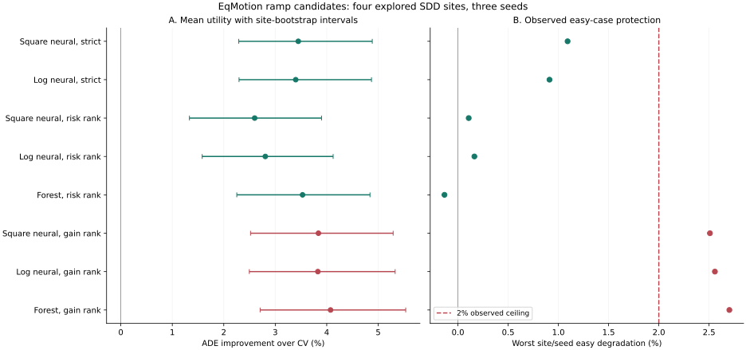
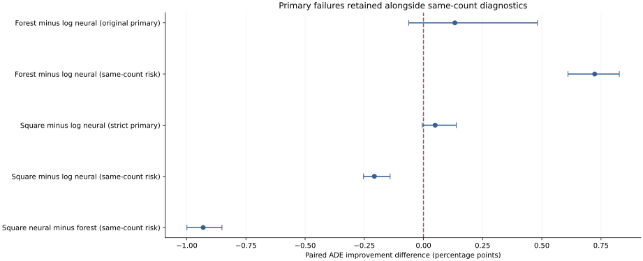

# Learning When to Replace a Motion Baseline: Conditional Harm, Risk Ranking, and Sparse Joint Support

English evidence draft, 22 September 2026. This revision extends the frozen
[first evidence draft](../evidence_manuscript_v1/manuscript.md). It reports completed
development studies, not an independently confirmed method or a submission-ready
paper. No model is trained or selected by assembling this document.

## Abstract

Accurate motion forecasting does not imply reliable replacement of a strong
baseline. We study intervention policies that learn the benefit and harm of using
a neural forecast instead of causal constant velocity. Using eight observed and
twelve predicted annotation steps on four previously explored Stanford Drone
Dataset sites, we compare conservative neural cost heads, an ExtraTrees control,
matched intervention counts, and a matched empirical loss. With the same EqMotion
ramp candidates, the forest improves site-relative ADE by 3.53%, compared with
3.40% for the original neural rule; their paired difference has an interval
crossing zero. At an equal intervention count, forest risk ranking exceeds neural
risk ranking by 0.72 percentage points [0.61, 0.83], while both preserve observed
easy cases within the specified ceiling. Matching the forest loss in twelve new
neural heads does not repair ranking: its same-count gain falls to 2.60% from
2.81%. A causal-only audit finds just six distinct recording frames where joint
optimization changes decisions across the examined protected pools; it does not
measure forecasting improvement. These results separate fitting loss, conditional
harm, selection volume, and interaction support. They motivate independent risk
calibration and better-supported joint tests, but do not establish safe deployment
or world-model generalization. All intervals are conditional development-site
bootstraps; coordinates are annotation pixels, not verified physical units.

## 1. Introduction

A strong causal predictor makes a demanding reference for neural motion
forecasting. Many approximately linear or stationary trajectories need little
intervention. A neural forecast can reduce mean error while introducing damage
on these already accurate predictions. A second problem arises when separately
selected agent forecasts form an inconsistent scene. We ask when a neural
prediction is worth using, and whether scene-level decisions improve this choice
without sacrificing easy trajectories.

Our research hypothesis combines baseline-relative benefit and harm learning,
scene-level composition, and independent risk calibration. The present evidence
does not establish that full hypothesis. Instead, it tests several concrete
repairs and shows where they fail. A method contribution must survive strong
simple controls and conditioning on the examples it selects, not merely improve
an aggregate training loss.

The completed development studies yield three findings. First, useful neural
forecasts exist, but uncontrolled use violates easy preservation. Second,
relative-risk ranking can protect observed easy cases at the expense of utility;
a conventional tree control retains more utility than the examined neural head
at a fixed count. Third, matching the empirical loss does not close that gap,
and the examined protected candidate pools have little support for a joint
interaction claim. These are bounded empirical findings, not a proof that trees
are generally superior or that neural joint prediction cannot work.

## 2. Related Work and Scope of Novelty

EqMotion learns equivariant motion features and invariant interaction structure
[1]. We adapt its author core to one fixed forecast under our native-coordinate
loss and data protocol. This is neither a reproduction of its published
best-of-many benchmark nor a controlled isolation of equivariance. JFP models
dependencies between agents' future predictions [2]. Joint prediction and pairwise
compatibility are therefore not new contributions by themselves.

Regression with multi-expert deferral explicitly studies learned routing with
fixed predictors [3]. Our two-predictor intervention setting overlaps with that
established problem. Benefit/harm decomposition provides a diagnostic and
supervision design, not evidence that routing is novel. Selective regression also
shows why reducing coverage need not protect subgroups [4]. Our fallback returns a
forecast rather than abstaining, and our easy subset is outcome-defined rather
than demographic; we do not import fairness guarantees from that setting.

Learn then Test provides a framework for calibrating specified risks through
valid tests [5]. Our fixed engineering thresholds are not such a certificate.
ExtraTrees [7] supplies a conventional cost-regression comparator rather than a
new architecture. A contribution beyond these precedents still requires a
positive controlled method result, an appropriate calibration design, and broader
related-work coverage. This draft does not assert an exhaustive novelty search.

## 3. Task, Data, and Evidence Roles

### 3.1 Offline annotated-history task

We use eight observed and twelve predicted annotation steps at raw stride 12 on
SDD [6]. The population contains 175,756 past-eligible pedestrian queries from 33
recordings in four physical sites: coupa, deathCircle, gates, and hyang. Of these,
172,957 support observed-point ADE, 144,010 support final-step FDE, and 143,918
have all requested future positions. These support counts do not determine
inference membership. Missing labels are unknown, not correct predictions.

Inputs comprise past-indexed target and neighbor motion, masks, causal motion
descriptors, and fixed candidate forecasts. Explicit future targets are restricted
to fitting losses and evaluation; no central velocity or test endpoint goal is
an inference feature. There is an additional provenance limitation: supplied
historical annotations can be interpolated using later annotation controls.
Past-indexed access is not proof of real-time sensor causality. The current
contract is offline annotated history.

No verified geometry or time conversion is used. Native error means error in
annotation pixels. Raw-frame t+50 is a separate supplemental task, not twelve
predicted steps, fifty seconds, or a metric benchmark. Historical external
selector results under different, subsequently questioned lineage/selection
protocols are not pooled here or recertified by this revision.

### 3.2 Fitted-artifact exclusions

For an outer-held site O, its evaluated predictor excludes O from fitting. A cost
training row from another site R uses a predictor trained without both O and R.
Preprocessing follows the same fitting boundary. Three seeds, 17, 29, and 43,
are retained. These exclusions protect fitted lineage; all four sites have
nevertheless influenced research design and remain development-exposed.

The current risk-head experiments use **EqMotion forecasts**, not Transformer
forecasts. Shared data-loading utilities originate in an earlier Transformer
study, but a registered transfer step substitutes the native EqMotion prediction
archives. A subsequent nested EqMotion refit supplies the excluded cost-training
producers. The later cost studies inherit these forecasts. This lineage is bound
by hashes, with 12 outer views and 36 ordered inner groups checked against the
producer manifest. A reporting check must follow the actual prediction archive,
not infer the family from an imported utility's name.

Independent calibration requires more than removing a site from the head's own
training rows. All predictors that generated retained training targets must also
exclude that site. The existing feasibility audit rejects 36 shortcut reuse
views. A triple-excluded development design would require new producers and still
would not create independent confirmation from explored sites. No new calibration
or final-test roles are assigned in this revision.

### 3.3 Metrics and uncertainty

ADE is Euclidean error averaged over available requested future positions; FDE
is evaluated only when the final requested position is observed. Errors are
averaged over seeds before calculating site-relative gains. For site s, reference
B and policy M, the summary is:

```text
G(M; B) = mean_s 100 * (E_s(B) - E_s(M)) / E_s(B).
```

Sites receive equal weight; overlapping windows are not independent replications.
Hard and positive-easy labels use training-only reference-error quantiles applied
to evaluation outcomes. They never enter inference. The easy criterion requires
degradation at most 2% in **every site and seed**, not just in the mean. Complete
exact-zero-reference cases are assessed separately in absolute error; no epsilon
makes an undefined percentage look safe.

Paired intervals reuse 3,000 physical-site bootstrap resamples from the source
experiments. They are conditional on four development-exposed sites and do not
adjust for the complete adaptive research history. Three seeds measure some
optimization variability; neither seeds nor bootstrap resamples increase the
number of independent sites. Per-site native ADE/FDE, p95/p99, and support counts
are retained in the supplementary exports rather than pooled as physical distance.

## 4. Method and Controlled Repairs

### 4.1 Bounded cost prediction

For baseline B, neural candidate N and complete target Y, define:

```text
b = max(ADE(B,Y) - ADE(N,Y), 0)
h = max(ADE(N,Y) - ADE(B,Y), 0)
D = mean_t ||N_t - B_t||_2.
```

The reverse triangle inequality gives b+h <= D. This elementary bound is not a
new theorem or a safety guarantee. For neural logits z, let u=softplus(z); the
two nonnegative predicted costs are D*u/(1+sum(u)). A zero disagreement forces
both costs to zero. The current head uses 356 causal features, a width-128 hidden
layer, and 45,954 parameters. Its outputs are continuous costs, not calibrated
failure probabilities. All standardization and cost scales are training-fitted.

### 4.2 Forecast action and policies

Recent comparisons use a fixed temporal ramp:

```text
N_ramp[t] = B[t] + (t / 11) * (N[t] - B[t]), t = 0,...,11.
```

The earliest requested forecast remains at the baseline, with full neural
displacement at the last step. A uniform blend matched on causal displacement
is a separate control; neither action is optimized with future targets. Costs
are trained for the actual candidate action, not blindly reused after changing it.

The strict rule requires past motion support, positive disagreement, positive
predicted net benefit, and predicted harm no greater than one tenth of benefit.
Otherwise it keeps CV. This ratio is a fixed rule, not the 2% easy-risk tolerance.
For same-count diagnostics, causal candidates are ranked by estimated relative
risk or net gain using deterministic tie-breaking. The ratio arms retain the
same per-site/seed counts as the frozen forest reference. This isolates count,
not displacement mass or realized risk, and is a batch diagnostic rather than
an independently calibrated online policy.

### 4.3 Estimator and loss controls

The tree comparator uses 128 ExtraTrees, maximum depth 16, minimum leaf size 64,
one-third feature sampling, and no bootstrap. Both costs are fitted jointly as
fractions of candidate disagreement, with the registered distance and
decision-region weighting. The comparison holds the forecast, causal inputs,
training supervision, and decision rule fixed, but not model capacity or optimizer.

The neural loss repair keeps initialization, preprocessing, sample stream,
decision-region weights, width, and the 12,000-update budget identical to the
previous neural head. It replaces the compositional log objective with:

```text
mean_i w_i * (D_i / c_train) * mean_k (qhat_ik - q_ik)^2,
q_i = (b_i, h_i) / D_i.
```

At D=0 both cost targets are zero. Unknown targets are never sampled as zeros.
This matches the tree's empirical squared-cost objective up to a fixed
normalization and numerical precision. It does not match architecture,
regularization or optimization. AdamW, batch size 256, gradient clipping at 5,
and the registered fixed training budget are retained; no held-site checkpoint
selection is performed.

Earlier repairs include region weighting, adaptive emphasis, cross-objective
review, prefix-risk prediction, and temporal blending. Their failed contrasts
remain in [the full comparison table](tables.md); none is erased by a later
favorable secondary control.

### 4.4 Scene-level support

Joint binary intervention adds baseline-relative pairwise proximity terms to
individual expected gains, subject to count and predicted-harm constraints.
The corresponding unary-geometry control retains individual geometric terms
while removing the nonadditive interaction. Comparing only against a
geometry-free selector would confound geometry with coupling.

The latest audit examines whether newer protected candidate pools actually
contain nonadditive opportunities. It fixes the half-count rule, harm budget,
geometry radius and pair weight, and exhaustively enumerates feasible subsets.
It reads causal forecast/context information, not future outcome arrays. Changed
decisions measure opportunity for a proxy objective, not forecasting lift.
Unsupported context forecasts remain unpriced, not physically safe.

## 5. Results

### 5.1 Useful forecasting is not safe intervention

In the preceding common-protocol predictor comparison, uncontrolled Transformer
and adapted EqMotion achieve 7.633% and 11.043% ADE gain over CV, but mean easy
degradation is 21.710% and 35.250%, respectively. These are full candidates, not
the later ramp-controlled policies. They establish useful average predictions,
not a deployable replacement. The EqMotion adaptation is not compared to the
published benchmark in meters or best-of-K units.

### 5.2 Main risk-head comparison

| Policy | ADE gain % | FDE gain % | Hard gain % | Worst easy degradation % | Switches |
|---|---:|---:|---:|---:|---:|
| Square neural, strict | 3.447 | 4.976 | 3.589 | 1.092 | 37,030 |
| Log neural, strict | 3.398 | 4.900 | 3.675 | 0.911 | 33,793 |
| Square neural, risk rank | 2.600 | 3.825 | 2.585 | 0.107 | 22,539 |
| Log neural, risk rank | 2.807 | 4.122 | 2.971 | 0.164 | 22,539 |
| Forest, risk rank | 3.530 | 5.166 | 3.764 | -0.134 | 22,539 |
| Square neural, gain rank | 3.839 | 5.313 | 5.769 | 2.509 | 22,539 |
| Log neural, gain rank | 3.828 | 5.281 | 5.807 | 2.558 | 22,539 |
| Forest, gain rank | 4.074 | 5.620 | 6.175 | 2.702 | 22,539 |

**Table 1.** All rows use the same EqMotion ramp candidate family. Worst easy
degradation is the maximum across all twelve site/seed views; negative means
improvement. Counts include repeated query/seed instances. Same-count net-gain
selection improves utility but violates the easy ceiling for every estimator.
The tree is a strong development comparator, not a new deployment recommendation.



**Figure 1.** ADE intervals and worst-site/seed easy degradation answer different
questions. Passing the observed ceiling is not calibrated population protection.

### 5.3 Primary versus matched-count contrasts

The original forest-minus-neural comparison is +0.13273 percentage points,
95% interval [-0.06206, +0.48134]. Its primary superiority requirement fails.
At the same switch count, forest risk ranking exceeds old neural risk ranking
by +0.72331 points [0.61059, 0.82728]. All twelve site/seed differences favor the
forest in this diagnostic. This result does not replace the failed original
primary comparison or isolate estimator architecture from loss differences.

The new squared-loss neural strict policy exceeds the old strict policy by only
+0.04951 points [-0.00527, +0.13864]; its primary requirement also fails. At equal
counts, new risk ranking is worse by -0.20728 points [-0.25325, -0.14071], with
negative differences in all four sites. It trails forest risk ranking by
-0.93059 points [-0.99940, -0.85137]. Objective matching therefore does not repair
the examined conditional ranking failure.



**Figure 2.** Paired development-site intervals. Original primary contrasts are
retained alongside secondary same-count tests; no failed criterion is redefined.

### 5.4 Fitting and selected risk disagree

The loss-matched neural repair improves its reconstructed full-fitting objective
over the old neural head in nine of twelve views. Nevertheless, both new strict
and new risk-ranking selections underestimate mean harm in all twelve held views.
Median realized-to-predicted harm ratios are 2.76 for new strict and 5.75 for new
risk ranking; old neural risk ranking is 3.84. The forest on its own selected
region is 0.61, with no underestimating view. These are conditional mean
diagnostics, not probability calibration or individual guarantees.

Missing outcomes also matter. New strict selects 5,680 incomplete-future
instances, including 606 with unknown ADE. New risk ranking selects 2,917,
including 329 unknown. Forest risk ranking selects 2,663, including 190 unknown.
These are query/seed instances, not unique independent people. Some neural
full-grid gain bounds remain negative. The forest's positive aggregate bounds
do not establish safety on the unknown easy subset. Complete exactly CV-correct
cases incur zero new harms for square strict and forest risk ranking, versus one
for old log strict; this observed check is still not population certification.

### 5.5 Joint opportunities are sparse

The earlier full-candidate joint-versus-unary study produces an exact observed
zero accuracy contrast. The newer ramp support audit is separate and makes no
accuracy readout. It examines 62,796 scene/seed queries per pool. Forest-risk,
log-strict and square-strict pools contain 62, 91 and 113 nonadditive opportunities
and change 3, 4 and 3 decisions, respectively. The three forest changes are one
recording frame repeated across seeds, not three independent interactions.
Across pools there are only six distinct changed frames.

All 266 opportunities were enumerated: 61,024 subsets, of which 18,521 were
feasible, with no enumeration cap reached. In 56/62, 66/91 and 84/113 opportunities,
the pair-product range is below the relevant unary gap. Another 21,897 unsupported
context-forecast edges in 5,400 queries remain unpriced. The fixed conservative
pool provides weak support for a substantial joint contribution. This does not
justify a broad held-result pair-weight search or a claim about all joint models.

## 6. Failure Analysis and Limitations

The evidence favors a conditional-risk diagnosis over a simple lack-of-training
explanation: improved fitting loss does not translate to reliable selected harm.
However, we have not established the optimal remedy. A fixed ratio is not a
calibration method, and a conventional estimator's conservatism on its own
choices need not hold on another policy's choices.

Four explored physical sites limit both inference and adaptation. Dependent
windows, incomplete future labels, and only three optimization seeds further
restrict claims. Historical external gains have not been independently restored
under the current lineage and role contract. Source downloads and release split
names alone do not establish legal reuse, physical-site independence or untouched
confirmation. Proposed independent calibration/data roles remain undecided.

The causal-only joint audit cannot assess predictive accuracy. Proximity and
discrete smoothness remain coordinate proxies, not collision probabilities or
physical acceleration. Neither image/video utility nor JEPA contribution is
established by these cost-head experiments. A reliable multimodal multi-agent
world model remains the broader objective, not a description of the result.

The work is not true 3D, a foundation model, metric prediction, seconds-level
forecasting, or human-gold annotation. Stage5C and SMC remain off. No new model
is deployed on the basis of these development results.

## 7. Reproducibility and Remaining Requirements

Sixteen analysis files and four producer/action code files are SHA256-pinned.
The export regenerates eight main rows, 32 native site summaries, 96 site/seed
summaries, fourteen paired contrasts, three joint-support summaries and two
vector figures. JSON pointers identify source values. The optional local lineage
check reads only producer metadata. It is not another forecast evaluation.

The original runs used native arm64 PyTorch, four computation threads, one
inter-op thread and zero DataLoader workers. Twelve loss-matched neural heads
completed 144,000 updates and 36,864,000 draws in 123.28 recorded head-fit seconds.
Twenty-four forest heads took 619.66 recorded fit seconds. These exclude upstream
forecast fitting, I/O and verification, and are not whole-pipeline timing or
hardware-normalized estimator comparisons. Checkpoints contain model, optimizer,
sampler and random-generator state. The [Chinese tutorial](reproduction_zh.md)
separates aggregate export, local replay, new training and unconfigured HPC work.

Submission readiness still requires an approved independent calibration and final
confirmation design, a supported intervention contribution, sufficient joint
event support, compatible external evidence, and a venue-compliant anonymous
release. This public draft is not anonymous simply because it omits an author
list. No paper-blind or external scientific peer review has been completed for
this revision. Formatting and replay cannot satisfy those scientific gates.

## 8. Conclusion

Learning accurate forecasts, predicting intervention costs, and composing safe
scene-level decisions are distinct problems. Conventional risk ranking exposes a
meaningful weakness in the examined neural cost head; matching the loss does not
fix it. Sparse protected interaction support limits the present joint hypothesis.
The next useful evidence must test conditional harm on independently admitted
scenes and demonstrate a controlled contribution, not recycle development gains
as confirmation. The research objective remains unmet.

## References

1. Chenxin Xu, Robby T. Tan, Yuhong Tan, Siheng Chen, Yu Guang Wang, Xinchao Wang,
   and Yanfeng Wang. *EqMotion: Equivariant Multi-agent Motion Prediction with
   Invariant Interaction Reasoning.* CVPR, 2023.
   [Author manuscript](https://arxiv.org/abs/2303.10876v2).
2. Wenjie Luo, Cheolho Park, Andre Cornman, Benjamin Sapp, and Dragomir Anguelov.
   *JFP: Joint Future Prediction with Interactive Multi-Agent Modeling for
   Autonomous Driving.* arXiv:2212.08710, 2022.
   [Original manuscript](https://arxiv.org/abs/2212.08710).
3. Anqi Mao, Mehryar Mohri, and Yutao Zhong. *Regression with Multi-Expert Deferral.*
   ICML, PMLR 235:34738-34759, 2024.
   [Proceedings](https://proceedings.mlr.press/v235/mao24d.html).
4. Abhin Shah, Yuheng Bu, Joshua K. Lee, Subhro Das, Rameswar Panda, Prasanna
   Sattigeri, and Gregory W. Wornell. *Selective Regression under Fairness Criteria.*
   ICML, PMLR 162:19598-19615, 2022.
   [Proceedings](https://proceedings.mlr.press/v162/shah22a.html).
5. Anastasios N. Angelopoulos, Stephen Bates, Emmanuel J. Candes, Michael I. Jordan,
   and Lihua Lei. *Learn then Test: Calibrating Predictive Algorithms to Achieve
   Risk Control.* arXiv:2110.01052, version 5.
   [Original manuscript](https://arxiv.org/html/2110.01052v5).
6. Alexandre Robicquet, Amir Sadeghian, Alexandre Alahi, and Silvio Savarese.
   *Learning Social Etiquette: Human Trajectory Understanding in Crowded Scenes.*
   ECCV, 2016. [Dataset release](https://cvgl.stanford.edu/projects/uav_data/).
7. Pierre Geurts, Damien Ernst, and Louis Wehenkel. *Extremely randomized trees.*
   Machine Learning 63:3-42, 2006.
   [Publisher](https://doi.org/10.1007/s10994-006-6226-1).
