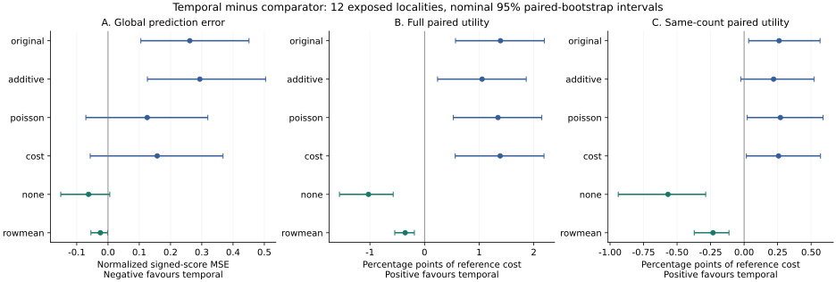
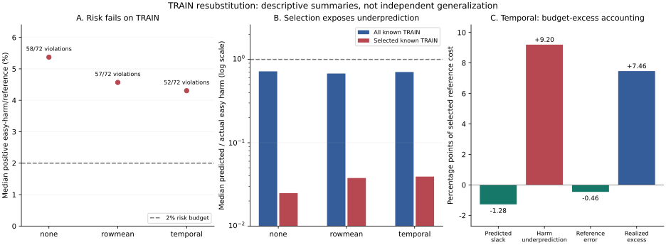

# When Better Forecast-Cost Prediction Fails to Produce Safer Intervention

English development-evidence manuscript, 7 October 2026. This revision integrates
the completed temporal-auxiliary experiment and its TRAIN replay. It replaces the
pending-experiment narrative in the previous draft without rewriting that dated
record. It is not an anonymous or submission-ready manuscript.

## Abstract

Neural motion forecasts can improve difficult trajectories while damaging cases
already handled well by a strong causal baseline. We study whether predicting
baseline-relative benefit and harm supports useful, reliable intervention between
frozen forecasts. Separate development studies on Stanford Drone Dataset sites
and EuropeanSquares localities expose a gap between cost prediction and policy
quality. On four explored Stanford sites, a conventional forest is competitive
with neural risk ranking, but its original unmatched superiority test fails.
On twelve explored European localities, TRAIN-fit improvements fail to transfer
to recording-held cost prediction. We then train 216 matched neural cost heads
with no auxiliary, row-mean auxiliary or temporal auxiliary supervision. Temporal
supervision improves signed-score mean squared error (MSE) against row-mean
supervision by 0.024422,
yet worsens paired lower intervention utility by 0.353836 percentage points of
reference cost; both nominal locality-bootstrap intervals exclude zero.
All temporal views violate the completion-upper selected easy-harm budget.
A subsequent TRAIN-only replay shows that all 216 heads underestimate harm on
their own selected populations, so unseen-domain shift cannot be the sole
explanation. These controlled negative results distinguish prediction quality,
selected-policy utility and risk support. They do not establish calibrated
safety, independent cross-scene confirmation or world-model success.

## 1. Introduction

For a system with a useful motion baseline, a neural forecast is valuable only
when using it improves the complete prediction policy. An average displacement
gain does not reveal whether the model damages otherwise easy cases. Reporting
only selected neural predictions creates another ambiguity: apparent improvement
may reflect which cases were retained rather than a better deployment policy.
The relevant question is when intervention adds value relative to an explicit
reference, on the population the decision rule actually selects.

M3W is a broader programme on multimodal multi-agent world models. This paper
studies one narrower component: supervised selection between frozen forecasts.
It does not present new video prediction, generative rollout, or a demonstrated
end-to-end neural dynamics improvement. The upstream trajectory predictor and the
intervention head support different scientific claims and are evaluated as such.

Our hypothesis separates three requirements: conditional benefit and harm should
be predictable; a decision rule should retain this accuracy on selected cases;
and independent scenes should confirm useful intervention within the specified
risk budget. Scene-level joint decisions introduce a further requirement when
independently chosen forecasts conflict. Neither low global loss nor a successful
neural training run establishes all of these properties.

The current evidence is negative but specific. We retain failed primary tests,
conventional strong controls, unknown outcomes and unsupported denominators.
The completed temporal experiment improves one prediction contrast but worsens
utility against its matched auxiliary control. Harm underprediction is already
present on TRAIN-selected cases. This motivates a targeted loss experiment, but
does not prove that modifying a loss will repair the policy. The distinction
prevents architectural complexity or a favourable secondary contrast from being
substituted for the stated hypothesis.

## 2. Related Work and Contribution Boundary

EqMotion models equivariant motion and invariant interactions [1]. Our SDD study
uses an adaptation of its author implementation under a local coordinate and loss
protocol, not a reproduction of its published best-of-many benchmark. JFP models
dependencies among future agent predictions [2]. Joint forecasting and pairwise
compatibility are therefore not innovations established by this project.

Regression with multi-expert deferral includes routing around pretrained
regression experts with regression costs [3]. Predicting baseline-relative costs
and choosing a fallback overlap with this established problem. The present work
cannot claim generic routing, cost awareness or reference-policy protection as
its novelty. A positive methodological claim would need a distinct mechanism and
matched evidence beyond these alternatives.

Learn then Test uses hypothesis testing for risk calibration [4]. Conformal Risk
Control gives an expected-risk result under conditions including exchangeability
and an appropriate bounded monotone loss family [5]. Our learned thresholds are
not either procedure. Overlapping windows are not independent calibration units;
changing selected agents can also make a selected harm ratio nonmonotone.
Conformal Policy Control addresses optimized policies relative to a reference
policy under its own probabilistic and calibration requirements [6]. We have not
implemented its construction or established its assumptions. It supplies no
guarantee for the empirical ratios reported here.

The mismatch between prediction accuracy and decision quality is established
prior work, not our discovery. Smart Predict-then-Optimize trains cost estimates
using decision regret and a surrogate for linear-objective optimization over a
known feasible set [7]. Task-based learning differentiates through stochastic
optimization to fit models for their downstream purpose [8]. Decision-focused
learning extends this motivation to combinatorial problems through continuous
relaxations [9]. We have not implemented these methods as matched empirical
controls. Consequently, our negative results do not establish superiority to
decision-focused learning. Our selected-risk coefficients are themselves learned,
and some future costs are unobserved; neither a decision-regret surrogate nor a
differentiable optimizer alone certifies our selected easy-harm ratio. This is an
applicability limitation, not evidence that these methods cannot be adapted.

The current contribution is a controlled development investigation of the gap
between cost prediction and selected-policy reliability in the stated forecasting
protocol, not discovery of the general prediction-decision gap. Temporal supervision is
a tested, unsuccessful repair in its examined form. The TRAIN decomposition
narrows possible explanations without identifying a causal mechanism. This is a
targeted literature positioning, not an exhaustive novelty certification or a
claim that the broader M3W research objective has been achieved.

## 3. Data and Evidence Roles

### 3.1 Separate development cohorts

Both studies observe eight annotation steps and predict twelve, with raw stride
twelve. Twelve predicted steps are not raw-frame t+50. The latter is a separate
supplemental task. No result here is converted to seconds or metres.

The earlier Stanford Drone Dataset study [10] contains 175,756 past-eligible
pedestrian queries from 33 recordings in four explored sites: coupa,
deathCircle, gates and hyang. Observed-point average displacement error (ADE) is
available for 172,957 queries, final displacement error (FDE) for 144,010, and
complete futures for 143,918. The queries overlap and are not independent people
or independent experiments. Historical annotation interpolation can use later
annotation controls; past-indexed access is therefore an offline annotated-history
contract, not proof of real-time perception causality.

EuropeanSquares contributes released detector tracks [11], not human-gold
trajectories. Twelve previously explored localities supply source development.
The source index has 318,969 unique entries before repeated use across rotations.
The frozen readout contains 596,988 row occurrences across 72 source/head views,
including 14,076 wholly unknown outcomes. Different reuse levels are not added
together. Head seeds 17, 29 and 43 are not independently retrained forecasters.
Whole-recording TRAIN/validation partitions within these localities provide
recording-held development, not locality-held independent confirmation.

SDD displacement contrasts and European normalized cost contrasts remain separate.
There is no pooled cross-dataset effect. Historical Stage26/37 figures involve
different populations, horizons and development exposure; they are not inserted
as directly comparable independent-test baselines.

### 3.2 Inputs and lineage

Inference uses past-indexed target and neighbor histories, past-derived motion
and quality descriptors, and causal reference/candidate rollout diagnostics. The
European cost interface has 380 features. No future endpoint, future remaining
track length, central velocity or test-endpoint goal enters the interface. Future
positions and masks are used for training losses and offline evaluation only.
Their availability does not determine deployment eligibility.

Producer exclusions, preprocessing sources and recording partitions are frozen
lineage, not reconstructed by naming a file test. All twelve European localities
have informed development. Reserved independent selection, calibration and
confirmation roles remain closed. The aggregate export underlying this revision
does not reopen trajectory labels or perform new model inference.

## 4. Baseline-Relative Cost Learning

### 4.1 Benefit, harm and easy-case risk

Let r(x) be the reference forecast and n(x) the neural candidate. On the same
observed future support, let their losses be R and N. Define

```
B = max(R - N, 0)              H = max(N - R, 0).
```

The European head predicts conditional moments B, H, R, ER and EH, where
ER = eR and EH = eH. The easy event e uses the fixed TRAIN-derived cutoff on
positive constant-velocity error. This event is distinct from the protected
reference forecast r, which can itself be TRAIN-selected. True e is a label,
not an inference feature.

The bounded decoder enforces nonnegativity, ER <= R, EH <= H and a causal
forecast-disagreement envelope. The decision scores are predicted net benefit,
all-risk excess and easy-risk excess:

```
B_hat - H_hat
H_hat - 0.02 R_hat
EH_hat - 0.02 ER_hat.
```

Frozen causal eligibility and support guards accompany these scores. Unsupported
cases return the reference. Predicted inequalities are not guarantees about
realized risk. Selected easy risk is weighted positive easy harm divided by
weighted easy-reference cost. It is not net easy ADE degradation, failure
probability or collision probability. Undefined denominators do not pass.

### 4.2 Strong controls and estimator changes

The European comparison retains the original forest, an additive quality
adjustment, a positive-harm Poisson control and a squared-cost head. A fixed-model
support diagnostic compares TRAIN and validation errors by moment, selection
and TRAIN feature support. A later extension clips seven quality coordinates to
their known-TRAIN ranges within fixed leaves, retaining leaf routing and every
known-TRAIN prediction. This is a targeted extrapolation repair, not calibration.

### 4.3 Temporal supervision

For an observed future step, d(t) is candidate error minus reference error.
An analytic screen estimates signed step errors and reference step errors with
TRAIN-only query-balanced leaf means. A repeated whole-trajectory leaf mean and
a global temporal mean are separate controls. Missing steps do not enter target
means; unsupported leaf-step cells fall back to TRAIN global means.

Temporal positive error is not the original whole-trajectory harm. Using the same
observed-step weights, define G_H = mean(max(d(t),0)) and
G_B = mean(max(-d(t),0)). Then

```
H = max(mean(d(t)), 0) = G_H - min(G_H, G_B).
```

This is an accounting identity, not a new theorem. Replacing H with G_H would
change the scientific risk definition. We therefore retain the original primary
targets and train temporal outputs only as auxiliary supervision.

The matched neural experiment fits no-auxiliary, repeated-row-mean and temporal
auxiliary variants of the same width-32 moment encoder. Primary initialization,
query draws, AdamW settings, partitions and 2,000-update final checkpoints are
matched. Auxiliary weight is zero for the control and 0.1 for the two supervised
arms. There are 24 TRAIN contexts, three head seeds and three arms, yielding
216 fits. The trajectory forecasters are unchanged. All final heads were frozen
before the seven-arm development readout.

### 4.4 Unknown outcomes and paired evaluation

Disappearing trajectories do not receive zero error. For wholly unknown outcomes,
a causal disagreement envelope bounds the benefit-minus-harm contribution.
Partial observed-label error remains distinct from complete-future accuracy.
Neither completeness nor easy-label availability filters policy decisions.

Comparisons use each policy's full selections and same-query minimum-count
selections. A lower bound on the paired utility difference accounts for shared
unknown selections cancelling and exchanged unknown selections remaining
uncertain. It is different from subtracting two policy lower bounds. The primary
paired quantity is reported below; lower-proxy differences remain in the complete
readout rather than being substituted when more favourable.

### 4.5 TRAIN-selected harm diagnosis

After the failed temporal experiment, all 216 final heads are replayed on their
own original TRAIN packets without optimizer updates. For selected known rows,
let H_E = sum(eH), R_E = sum(eR), and let predicted aggregates be H_hat_E and
R_hat_E. With q = 0.02,

```
H_E - q R_E = (H_hat_E - q R_hat_E)
             + (H_E - H_hat_E)
             + q (R_hat_E - R_E).
```

The terms are predicted slack, harm underprediction and budget-weighted reference
error. They remain signed. Dividing by actual R_E expresses budget excess in
percentage points; it does not turn the terms into causal effects. This is a
resubstitution diagnostic, not new validation or a post-hoc calibration result.

## 5. Experiments and Results

### 5.1 SDD: strong simple comparators

| SDD comparison | ADE gain difference (pp) | Nominal 95% CI |
|---|---:|---:|
| Forest minus log neural (original primary) | +0.132728 | [-0.062063, +0.481336] |
| Forest minus log neural (same-count risk) | +0.723314 | [+0.610586, +0.827277] |
| Square minus log neural (strict primary) | +0.049515 | [-0.005267, +0.138640] |
| Square minus log neural (same-count risk) | -0.207277 | [-0.253252, -0.140711] |

**Table 1.** Earlier SDD development contrasts on four physical sites. Positive
values favour the first method. Values are percentage-point differences in
site-relative ADE gain, not raw pixel error. The original primary forest
comparison fails. Same-count comparisons are explicitly secondary and do not
replace the failed primary test. Original policy errors, easy degradation,
unknown outcomes and tails remain in the earlier evidence package.

A separate causal joint-support diagnostic identifies only six distinct
recording frames with changed decisions across the protected pools. It measures
opportunity, not improvement. We do not claim a joint-interaction contribution.

### 5.2 European cost fit and support repair

| ID | EuropeanSquares comparison | Change | Nominal 95% CI | Localities |
|---|---|---:|---:|---:|
| E1 | Cost minus original, TRAIN | -0.124240 | [-0.150777, -0.099481] | 12 |
| E2 | Cost minus original, validation | +0.104153 | [+0.018611, +0.220039] | 12 |
| E3 | Extension minus cost, validation | -0.126005 | [-0.246783, -0.030947] | 12 |
| E4 | Extension minus original, validation | -0.021852 | [-0.057900, -0.000175] | 12 |
| E5 | Extension minus additive, validation | +0.010294 | [-0.001532, +0.026280] | 12 |
| E6 | Temporal minus row-mean leaf, validation | -0.094342 | [-0.158824, -0.038614] | 12 |
| E7 | Temporal minus global temporal, validation | -0.137388 | [-0.232556, -0.047422] | 12 |
| E8 | Temporal minus row-mean leaf, complete labels | -0.098473 | [-0.159674, -0.047870] | 12 |
| E9 | Temporal minus row-mean leaf, original selected | +0.000043 | [-0.000140, +0.000256] | 11 |
| E10 | Extension minus cost, full utility | +0.000015 | [-0.000003, +0.000041] | 12 |
| E11 | Extension minus cost, matched utility | +0.000010 | [+0.000000, +0.000024] | 12 |

**Table 2.** Earlier European paired development contrasts. E1-E5 are normalized
signed-score MSE; E6-E9 are normalized step-error MSE. Lower is better, but their
scales are not interchangeable. E10-E11 are differences in utility as percent of
full known reference cost; higher is better. They are not ADE/FDE improvements.
E9 has eleven supported localities and is not a complete twelve-locality result.
The newer neural readout does not drop missing support to manufacture a contrast.

Cost fitting improves TRAIN scores but worsens validation scores (E1-E2).
The fixed diagnostic attributes about 82.15% of the increase to the easy-harm
moment; correlated support partitions are not separate causal explanations.
The TRAIN-identity extension improves global MSE but does not establish positive
full or matched utility over its cost parent. Much of its MSE repair occurs
outside the selected population.

| European policy | Selected occurrences | Unknown selected | Complete support / 72 | Defined easy risk / 72 | Known violations | Upper-bound violations | Worst easy upper % |
|---|---:|---:|---:|---:|---:|---:|---:|
| original | 95,455 | 918 | 33 | 43 | 4 | 7 | 5.4058 |
| additive | 112,456 | 1,143 | 19 | 61 | 20 | 42 | 1200.1684 |
| poisson | 111,031 | 1,050 | 37 | 51 | 2 | 11 | 18.0277 |
| cost | 96,720 | 926 | 36 | 48 | 4 | 7 | 5.7195 |
| extended | 96,718 | 926 | 36 | 47 | 4 | 7 | 5.7195 |

**Table 3.** Earlier five-policy European extension study. Counts repeat across
source contexts and seeds. Complete support, a defined denominator and acceptable
risk are different requirements. Undefined views do not count as passes.

### 5.3 Temporal information does not imply useful intervention

Analytic temporal leaves improve full signed step-error prediction against both
controls (E6-E8), but the restricted original-selected contrast includes zero
(E9). On observed selected labels, 39.84% of pooled gross positive step harm is
cancelled by negative errors on the same trajectory. This is a descriptive pooled
target calculation, not a cross-scene model gain.

The subsequent matched neural experiment is complete, not merely planned.

| Comparator | Signed-score MSE | Full paired lower utility | Same-count paired lower utility |
|---|---:|---:|---:|
| original | +0.261571 [+0.104999, +0.451020] | +1.390725 [+0.566962, +2.193647] | +0.261338 [+0.034097, +0.566836] |
| additive | +0.293717 [+0.126013, +0.504089] | +1.053742 [+0.239029, +1.861736] | +0.220231 [-0.024922, +0.521718] |
| poisson | +0.125410 [-0.070909, +0.319224] | +1.345108 [+0.527166, +2.147304] | +0.270922 [+0.023377, +0.589251] |
| cost | +0.157417 [-0.056953, +0.367987] | +1.384831 [+0.561310, +2.187567] | +0.257274 [+0.017003, +0.570425] |
| none | -0.062288 [-0.151167, +0.005691] | -1.026746 [-1.557310, -0.574154] | -0.567678 [-0.939022, -0.286494] |
| rowmean | -0.024422 [-0.054556, -0.001405] | -0.353836 [-0.545292, -0.186078] | -0.231955 [-0.372209, -0.112760] |

**Table 4.** Temporal neural supervision minus each comparator, estimate and
nominal 95% paired-locality interval. MSE improvement has a negative sign;
utility improvement has a positive sign. Utility is percentage points of full
known reference cost. Each comparison has twelve exposed localities and
3,000 bootstrap draws. Original-selected MSE is undefined for all six registered
contrasts because required support is missing; no view is discarded to fix it.

Temporal supervision improves signed-score MSE versus row-mean supervision, but
both full and matched paired utility become worse. The no-auxiliary model also
outperforms temporal supervision in both utility comparisons. Although temporal
utility exceeds the original forest, it fails stronger matched neural controls
and the absolute risk requirement. Selective emphasis on the forest comparison
would therefore give an incorrect account of the experiment.



**Figure 1.** All six temporal-minus-comparator contrasts, with nominal paired
locality-bootstrap intervals. Green denotes the matched neural controls, not a
pass decision. The error and utility axes have opposite favourable directions.
No cross-dataset quantity or fresh bootstrap is introduced by this plot.

| Policy | Selected occurrences | Unknown selected | Undefined easy risk /72 | Upper-risk violations /72 | Complete finite support /72 |
|---|---:|---:|---:|---:|---:|
| original | 95,455 | 918 | 29 | 7 | 33 |
| additive | 112,456 | 1,143 | 11 | 42 | 19 |
| poisson | 111,031 | 1,050 | 21 | 11 | 37 |
| cost | 96,720 | 926 | 24 | 7 | 36 |
| none | 107,596 | 1,487 | 0 | 72 | 0 |
| rowmean | 84,251 | 1,201 | 0 | 72 | 0 |
| temporal | 83,168 | 1,191 | 0 | 72 | 0 |

**Table 5.** Seven-arm development support and selected easy-risk accounting.
Occurrences are reused source/seed entries, not independent trajectories. All
three neural variants have 72 completion-upper risk violations and no full-policy
view with complete finite support. They are not certified safe. Matching counts
does not fix the temporal policy's negative utility contrast against row-mean.
All matched support rows, per-recording results and tails remain in the complete
registered readout. Advancement to transfer design is false.

### 5.4 Harm is underestimated before unseen-domain evaluation

| Auxiliary arm | TRAIN risk violations /72 | Median risk (%) | Median predicted/actual harm: all known | Median predicted/actual harm: selected known | Unknown selected |
|---|---:|---:|---:|---:|---:|
| none | 58 | 5.371021 | 0.718954 | 0.024865 | 2,496 |
| rowmean | 57 | 4.567470 | 0.676995 | 0.037706 | 1,911 |
| temporal | 52 | 4.304727 | 0.705898 | 0.039213 | 1,828 |

**Table 6.** TRAIN resubstitution of the same frozen neural heads. These are
descriptive medians of per-view ratios, not ratios of pooled medians, and are not
the development estimates in Table 5. Every arm underestimates selected harm in
all 72 views. Unknown selected occurrences remain unassessed, not labelled safe.

For temporal supervision, equal-locality mean budget excess decomposes into
-1.275936 pp predicted slack, +9.197277 pp harm underprediction and -0.457331 pp
budget-weighted reference error, summing to +7.464010 pp. Reference error is
protective on average, while selected harm underprediction dominates this
accounting. The replay verifies 432 scalar sum identities; larger logged numbers
of scalar contributions are not additional independent assertions.

Pure unseen-domain shift cannot explain failure that already occurs under TRAIN
resubstitution. This does not exclude extra domain shift, detector noise, missing
features, finite optimization or model misspecification. Selection can expose
conditional error that is small in the overall average. The next repair must be
evaluated by policy utility and selected harm, not only by its fitting loss.



**Figure 2.** TRAIN resubstitution, not held-out performance. Panels A and B show
medians of 72 per-view ratios for each arm; Panel C uses equal-locality means of
signed decomposition terms for temporal supervision. The fourth bar is the sum
of the first three. Different aggregation rules are not interchangeable. These
descriptive TRAIN panels do not carry newly calculated confidence intervals.

## 6. Uncertainty and Failure Analysis

Each development interval resamples 3,000 paired localities after averaging
repeated source/head views within locality. The three seeds quantify cost-head
training variation; they are not three independent forecast models. Overlapping
windows are not independently resampled. Four SDD sites and twelve European
localities are distinct populations, with no cross-dataset pooled estimate.
Intervals are nominal and development-exposed, without adjustment for the many
preceding design choices. Excluding zero does not restore confirmation status.

The combined evidence identifies five limitations of the examined approach:
TRAIN fit may fail to transfer to recording-held data; global prediction error
may improve while selected utility worsens; temporal and trajectory-level harm
are different targets; unknown outcomes and unsupported denominators restrict
risk conclusions; and selected harm can already be severely underestimated on
TRAIN. The last observation narrows a domain-shift-only explanation but is not
proof of a uniquely identified cause.

The studies do not establish that neural cost learning is universally ineffective.
They reject advancement of specific matched repairs. Architecture names, latent
variance, global MSE improvement and successful optimization are insufficient
substitutes for useful intervention that satisfies the selected-risk criterion.

## 7. Limitations and Research Status

Independent calibration and confirmation are not available among these results.
Scene images, goals and interactions are not established contributions of these
cost-head experiments. Useful joint-decision opportunities are sparse in the
current protected candidate pool. Dataset exposure, partial visibility,
detector tracking errors and annotation interpolation limit the causal and
generalization interpretations. These results are not a physical-safety system.

A successor experiment changes only the easy-positive-harm moment loss from
quadratic error to continuous-cost deviance, preserving the remaining losses,
sampling, budgets and decision rule. Its scientific readout is pending at this
revision. Historical bitwise replay differs on 18 of 72 quadratic controls;
same-node runs of the original and new trainers match exactly for these cases.
An explicit pre-readout reference amendment retains 54 historical-exact controls
and 18 exact original-implementation replays. Some historical differences are
large, and a specific low-level numerical cause is not established. This
execution amendment must not be described as complete historical replication,
nor used to infer scientific improvement before the paired readout.

The present intervention is deterministic selection between frozen forecasts,
not an interactive environment model. M3W remains a 2.5D trajectory world-state
research scaffold, not true 3D or a foundation world model. No verified homography,
metric scale or effective-time conversion is used. Detector-derived and inferred
labels are not human gold. Stage5C execution and SMC remain disabled.

The principal missing evidence is a controlled positive intervention result with
acceptable selected harm, followed by the reserved independent evaluations.
Anonymous venue formatting, independent scientific review and the complete
submission package also remain incomplete. This is an evidence-bearing research
draft, not a claim of CVPR or CCF-A submission readiness.

## 8. Reproducibility

The aggregate exporter verifies fourteen pinned source files, the linked
216 training receipts and 72 readout group receipts. It integrates the earlier
development tables, completed temporal contrasts and TRAIN diagnostic into one
manuscript. Source paths and JSON pointers accompany machine-readable values.
Rebuilding the manuscript is a fresh export of cached verified aggregates, not
retraining, new trajectory inference, independent replication or a new bootstrap.

The Chinese reproduction guide separates this lightweight export check from real
experiment execution. Native arm64 PyTorch is required locally. CREATE numerical
work runs in allocated jobs, with four compute threads, one interop thread and
zero DataLoader workers. Checkpoints preserve optimizer and random states. Model
weights and third-party trajectories remain outside Git. Local weight streaming
retains the storage reserve and does not create a disk checkpoint cache.

Original failures, execution amendments and support failures remain accessible.
Public aggregate verification does not freshly verify private checkpoint contents.
Exact prediction replay and independent scalar implementations verify algorithms;
they do not make the development population an independent scientific sample.

## 9. Conclusion

Forecast quality, cost prediction and selected-policy reliability are distinct
claims. In these development cohorts, strong conventional controls and matched
neural ablations reveal failures that a global fitting score conceals. Temporal
supervision improves one prediction contrast but worsens utility versus its
matched neural controls. TRAIN replay further shows that selected harm is
underestimated before unseen-domain evaluation. A successful method must close
this conditional decision gap without discarding unknown outcomes, replacing
failed comparisons or weakening the registered risk definition. That positive
result remains an open research requirement.

## References

1. Chenxin Xu, Robby T. Tan, Yuhong Tan, Siheng Chen, Yu Guang Wang, Xinchao Wang,
   and Yanfeng Wang. *EqMotion: Equivariant Multi-agent Motion Prediction with
   Invariant Interaction Reasoning.* CVPR, 2023.
   [Author manuscript](https://arxiv.org/abs/2303.10876v2).
2. Wenjie Luo, Cheolho Park, Andre Cornman, Benjamin Sapp, and Dragomir Anguelov.
   *JFP: Joint Future Prediction with Interactive Multi-Agent Modeling for
   Autonomous Driving.* arXiv:2212.08710, 2022.
   [Original manuscript](https://arxiv.org/abs/2212.08710).
3. Anqi Mao, Mehryar Mohri, and Yutao Zhong. *Regression with Multi-Expert Deferral.*
   ICML, PMLR 235:34738-34759, 2024.
   [Proceedings](https://proceedings.mlr.press/v235/mao24d.html).
4. Anastasios N. Angelopoulos, Stephen Bates, Emmanuel J. Candes, Michael I. Jordan,
   and Lihua Lei. *Learn then Test: Calibrating Predictive Algorithms to Achieve
   Risk Control.* arXiv:2110.01052, version 5, 2022.
   [Original manuscript](https://arxiv.org/abs/2110.01052v5).
5. Anastasios N. Angelopoulos, Stephen Bates, Adam Fisch, Lihua Lei, and
   Tal Schuster. *Conformal Risk Control.* ICLR, 2024.
   [Proceedings paper](https://proceedings.iclr.cc/paper_files/paper/2024/file/f3549ef9b5ff520a7e41ff3cc306ab2b-Paper-Conference.pdf).
6. Drew Prinster, Clara Fannjiang, Ji Won Park, Kyunghyun Cho, Anqi Liu,
   Suchi Saria, and Samuel Stanton. *Conformal Policy Control.*
   arXiv:2603.02196, version 1, 2026.
   [Version reviewed](https://arxiv.org/html/2603.02196v1).
7. Adam N. Elmachtoub and Paul Grigas. *Smart "Predict, then Optimize".*
   Management Science, 68(1):9-26, 2022.
   [Author manuscript, version 5](https://arxiv.org/pdf/1710.08005v5).
8. Priya L. Donti, Brandon Amos, and J. Zico Kolter. *Task-based End-to-end Model
   Learning in Stochastic Optimization.* NeurIPS, 2017.
   [Proceedings paper](https://proceedings.neurips.cc/paper/2017/file/3fc2c60b5782f641f76bcefc39fb2392-Paper.pdf).
9. Bryan Wilder, Bistra Dilkina, and Milind Tambe. *Melding the Data-Decisions
   Pipeline: Decision-Focused Learning for Combinatorial Optimization.*
   AAAI, 33(1):1658-1665, 2019.
   [Proceedings paper](https://ojs.aaai.org/index.php/AAAI/article/view/3982).
10. Alexandre Robicquet, Amir Sadeghian, Alexandre Alahi, and Silvio Savarese.
   *Stanford Drone Dataset.*
   [Dataset and associated ECCV 2016 work](https://cvgl.stanford.edu/projects/uav_data/).
11. Nils Wolff and Layne Perry. *Pedestrian Trajectory Dataset of Public European
   Squares.* Zenodo, release v1.1, 2026.
   [Dataset record](https://zenodo.org/records/18267205).

Earlier source-checked references are retained. The 7 October update adds three
original decision-learning papers and narrows, rather than expands, the novelty
claim. Their empirical comparison remains not_run; no theorem is transferred.
Locally audited release restrictions remain authoritative for cached assets.
