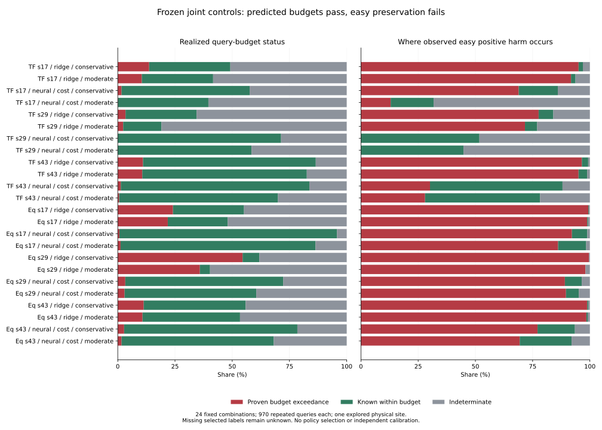

# Why Predicted Risk Budgets Did Not Preserve Easy Cases

Status: completed descriptive development diagnosis, not a new model or a safe
deployment result. `fresh_run` applies to the risk calculations; frozen model
outputs, decisions, labels and source bindings are `cached_verified`. Training,
new inference, policy selection and independent risk calibration are `not_run`.
No main-evaluation, bookstore or previously unopened external data were scored.

## Scope

All 24 fixed Transformer/EqMotion combinations, three seeds, two cost heads and
two policies are retained. Each has three selection controls: risk-only,
geometry-aware independent and joint. Each of the resulting 72 cells uses the
same 970 scene queries and 37,775 past-eligible agent queries. Complete ADE is
available for 28,324 agents; 9,451 lack the required complete future labels.
There are 4,359 complete-label easy agents per cell, under the unchanged baseline
ADE threshold 0.02349376610737637. Labels define evaluation groups, not inputs.

Students01 and students03 are two already explored UCY recordings of one
physical university site. Seeds, controls and overlapping windows are not extra
independent scenes. No independent-scene confidence interval is claimed.
This analysis was specified after the parent comparison and is explicitly
post-hoc diagnosis, not preregistered confirmation.

## Findings

| Question | Observed result |
| --- | --- |
| Did the numerical predicted query-harm budgets pass? | Yes, every query in all 72 cells. The frozen budgets are 0.01/0.03 past-normalized ADE for conservative/moderate policies. |
| Did that imply the same realized budget was satisfied? | No. Already observed labels prove between 0 and 529 of 970 queries exceed the corresponding budget, depending on the fixed cell. |
| Were observed costs generally underestimated? | In 63/72 cells, mean query harm lower bound already exceeds mean predicted harm. This is descriptive underestimation on these records, not an independent calibration test. |
| Is imperfect prediction the only problem? | No. Queries whose selected costs are all known and whose realized global budget is met contribute 0.039% to 57.878% of observed easy positive harm across cells. |
| Would retaining just those known-within-budget queries fix easy preservation? | Even that outcome-defined subgroup has more than 2% aggregate relative easy degradation in every cell. It is not a usable deployment filter, since membership requires outcomes. |
| Can all remaining risk be certified? | No. There are 41-785 indeterminate queries and 45-3,531 selected agents with unavailable ADE costs per cell. Missing selected costs are not zero. |

All 72 cells still fail the original easy-preservation requirement. No new winner
is selected. See [every fixed result](complete_results.md),
[machine-readable summaries](all_controls.csv) and
[fixed-bin descriptive reliability](reliability_bins.csv).

The figure shows all 24 full-joint combinations for readability. The tables
retain all 72 controls. Green means an exact realized global budget is met on
that stored query; it does not mean easy-safe, independently calibrated or
physically safe. Gray means selected outcomes are unavailable. The right panel
allocates observed easy positive harm, not net benefit or total missing risk.

## Concrete Examples

- EqMotion seed29/ridge/conservative, full joint: 529 queries provably exceed
  the 0.01 budget; 71 are completely known within budget; 370 are indeterminate.
  Mean predicted harm is 0.00018109 and the observed mean lower bound is
  0.09981722. The known exceedance group contributes about 99.575% of observed
  easy positive harm. This is a severe cost-underprediction case in these data.
- Transformer seed29/neural-cost/conservative, full joint: zero queries have a
  proven exceedance, but 278 are indeterminate. The 692 known-within queries
  contribute 51.750% of observed easy positive harm. Zero proven exceedances
  therefore does not certify easy preservation or the unknown queries.
- Transformer seed43/neural-cost/conservative, full joint: 799 known-within
  queries contribute 57.878% of observed easy harm; 13 queries prove an exceedance
  and 158 remain indeterminate. Better cost calibration alone cannot make the
  existing absolute global cap equivalent to the relative easy requirement.

Examples illustrate different failure modes; they are not post-hoc model choices.

## Failure Taxonomy

1. **Observed cost underprediction.** Frozen expected-harm scores understate
   realized positive excess in many cells. This analysis does not identify
   whether the cause is underfitting, training distribution shift, target
   conditioning or another modeling defect. Dependent development outcomes
   cannot certify conditional calibration or isolate that causal explanation.
2. **Constraint mismatch.** An average absolute-harm cap over all past agents is
   not a relative ADE cap on the easy subset. Many unswitched or hard agents can
   dilute the global mean while a small easy baseline denominator makes a small
   absolute error unacceptable. This mismatch persists with perfectly known
   costs; it is not a solver bug and cannot be repaired solely by calibrating the
   existing scalar risk estimate.
3. **Incomplete selected labels.** An observed nonnegative-harm sum is only a
   lower bound when selected costs are missing. Unswitched trajectories have
   structurally zero excess because their prediction is exactly the baseline;
   missing selected costs are conservatively unknown. No future is fabricated.
4. **Limited independent support.** This is one explored physical site. More
   windows, model seeds or bootstrap resamples cannot turn it into independent
   scene-level risk calibration or final confirmation.

## What Changes Next, And What Does Not

This work changes the diagnosis, not the deployed policy. It does not justify
another sweep of pair weights, cost multipliers or validation thresholds on
these same outcomes. The preceding joint-control study remains negative.

The shortest defensible repair is to resolve the pending primary-metric decision,
then register a risk target that actually corresponds to the chosen easy metric.
That target needs the joint conditional contribution of being easy and being
harmed, with an appropriate baseline denominator, rather than only global harm.
The algebra and required evidence are in [method and limits](method_and_limits.md).
Implementing, fitting or deploying that changed target is not done here and
requires a new registered experiment. The old metrics and all negative results
must remain visible. Independent calibration/confirmation support remains a
separate data requirement, not something a better loss can manufacture.

Current scientific gate: neural easy preservation failed; useful coupling gain
and independent risk calibration remain unproved. No model promotion. Historical
Stage26/37 gains remain exploratory after the lineage/test-selection audit.
The project is not yet a submission-ready method, true 3D or a foundation model.
Dataset-local coordinates and annotation steps are not verified meters or seconds.
Stage5C and SMC remain disabled.

## Verification

The runner checks parent completion hashes, source exports, frozen execution
code and every batch receipt. Original identity, selected-error and aggregate
checks are repeated, and the existing easy metric is reconstructed without
changing its population. All 24 candidates complete; completed resume replays
the same 72 summaries with zero new candidate calculations.

A separate NumPy reduction checks all 72 summaries and 69,840 repeated query
statuses against receipt-bound details; see [verification](verification.json).
These counts are computation checks, not independent observations. Forty-two
scoped tests pass, including a truthful-global-budget counterexample, unknown
selected costs, unchanged fallback, identity/mask checks and denominator tests.
Full historical report-writing integrations were not rerun. No needed training,
evaluation or verification process remains running.

Reproduction, source hashes and timings: [execution notes](execution_notes.md).
