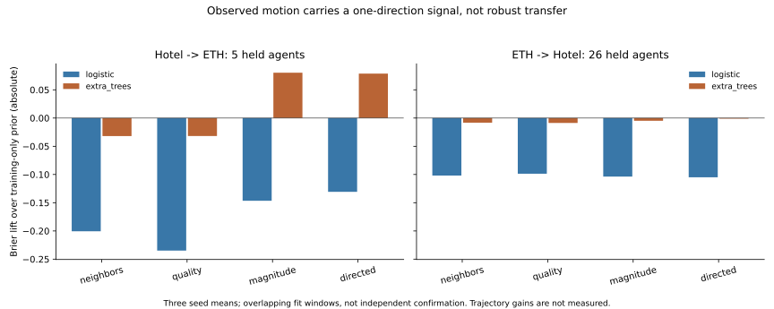

# Past Motion Has a One-Direction Start Signal, Not Robust Transfer

## What This Experiment Adds

The preceding neural trajectory studies could not separate weak input information
from a difficult displacement objective. This experiment removes displacement
regression entirely and asks whether the frozen past summaries predict any
annotated coordinate change after a stationary history. It fits 48 classifiers
afresh, not another neural trajectory model. No deployment changes.

The answer is asymmetric. Tree models with motion features improve probability
prediction when trained on Hotel and evaluated on ETH. Reverse transfer remains
close to chance ranking and does not improve mean Brier over the training prior.
There is no setting with positive mean Brier lift in both directions.

## Complete Key Comparison

All entries are three-seed means. Brier lift is an absolute score difference,
not a percentage and not ADE/FDE improvement. Positive means less probability
error than the smoothed opposite-scene training-only prior.

| ExtraTrees inputs | Hotel -> ETH Brier lift | ETH AUROC | ETH -> Hotel Brier lift | Hotel AUROC |
| --- | ---: | ---: | ---: | ---: |
| Pooled neighbor history | -0.03195 | 0.6692 | -0.00820 | 0.5003 |
| Add image quality/support | -0.03185 | 0.6857 | -0.00870 | 0.4878 |
| Add motion magnitude | +0.08030 | 0.8105 | -0.00484 | 0.5004 |
| Add directed motion | +0.07870 | 0.8215 | -0.00101 | 0.5118 |

Both motion tree arms improve ETH Brier in all three seeds. In Hotel, magnitude
has no positive seed and direction only one. All 24 logistic fits are negative
against the prior, despite positive in-training Brier gains. The full
[table](results.md) includes every model, seed-mean metric and group diagnostic;
none is removed because it weakens the result.



## Independence and Uncertainty

The stationary cohort remains 365 overlapping windows: 81 ETH windows from five
local agent IDs and 284 Hotel windows from 26 IDs; 45 stationary runs total.
No new site, person or annotation has been added. Zara has no exactly-stationary
histories and is not_run for this probe, not a passing external domain.

ETH motion-magnitude agent-balanced Brier lift versus the training prior is
0.08960, with descriptive 2,000-draw held-agent interval [0.02276, 0.15643].
However, the incremental lift versus quality-only is 0.09881 with interval
[-0.02856, 0.24361]. Directed motion is similar: 0.08642 versus prior, but its
incremental quality-controlled interval also crosses zero. All five ETH agents
have positive seed-mean lift versus the prior; that does not add independent
sites or remove possible contemporaneous-agent dependence.

Hotel directed motion has agent-balanced lift 0.01801 versus prior, interval
[-0.03993, 0.08207], and 0.00416 versus quality, interval [-0.00296, 0.01160].
Window-level mean lift remains negative. Group weighting changes the estimand
and some signs; it is not used to rescue the failed predefined bidirectional test.
Bootstrap averages seed losses, not probabilities, so it does not create an
unreported ensemble. Logistic seeds reproduce the same solution and are not
independent replications. All intervals condition on fitted models and these
historically exposed sites; they are not independent confirmation or calibrated
new-scene risk guarantees.

## Failure Taxonomy and Next Action

1. **There is some localized predictive information.** Replacing trajectory loss
   with a proper probability objective reveals a Hotel-to-ETH signal in the
   tree family. This is stronger than saying the flow summaries are universally
   useless. It is weaker than proving a transferable visual contribution.
2. **Reverse transfer is the key failure.** ETH supplies only five stationary
   agent IDs, and changed-future prevalence differs (72.84% ETH, 45.42% Hotel).
   These are observed support and distribution differences, not an isolated
   causal explanation. Current results do not tell whether more ETH-like people,
   a better feature, or a different representation alone would solve it.
3. **Ranking is not calibration, and probability is not trajectory.** The neural
   forecasting failures cannot be repaired merely by inserting the favorable
   0.82 AUROC into a switching gate. Departure direction, displacement and the
   harm of a particular candidate forecast are still unproved.
4. **More flexible inputs can fit rather than transfer.** All in-training Brier
   contrasts are positive. Logistic generalization fails throughout; quality
   alone is not useful in either direction. No threshold or held-site calibration
   was fitted to hide this behavior.

Do not launch another residual head or tune switches from this probe. The next
useful step needs independently supported, observable state-change information.
The pending decision on separately registered SDD auxiliary training is unchanged;
this experiment does not authorize it. A future augmentation must preserve the
primary ETH/UCY roles and compare against unchanged controls. If that source is
not admitted, the unmet support requirement should be recorded instead of
repeating the same two-scene search indefinitely.

## Provenance, Runtime and Reproduction

`fresh_run`: 48 sklearn classifier fits, 2.56 seconds summed fitting, no fit
warnings; paired scoring and conditional agent bootstrap. The cached summaries
are small, so long runtime is unnecessary. This is not neural/full-scale training.
The fixed design/code was pushed as `82c15be0` before any fit.

`cached_verified`: source and producer hashes, the complete stationary-to-full
query join, fold/scene/label agreement, past-flow arrays and every saved classifier.
All 48 checkpoint probabilities replay bit-exactly. Completed resume performs
zero fits and preserves 97 model/prediction/report hashes. Eighteen focused tests
pass; the full legacy suite was not rerun. Model checkpoints, predictions and
input arrays remain private. Public outputs contain aggregate metrics and an
original plot. Single-process native arm64 execution; no multiprocessing loader,
Torch training claim, new HPC probe or remote job.

All 11,966 original forecasting rows, the eight-observed/twelve-predicted native
annotation-step task and its past-normalized equal-scene ADE primary remain
unchanged. Only past feature summaries enter estimators. Future coordinates
define supervised labels and score predictions; identifiers/run boundaries are
audit or grouping fields only. Offline annotation interpolation remains disclosed.
No strict sensor-as-of, metric/seconds, verified intention, true-3D, foundation,
Stage5C, SMC, deployment or submission-readiness claim follows.

```bash
.venv-pytorch/bin/python scripts/run_m3w_motion_start_probe.py --registration configs/m3w_motion_start_probe.json
.venv-pytorch/bin/python scripts/run_m3w_motion_start_probe.py --registration configs/m3w_motion_start_probe.json --replay
.venv-pytorch/bin/python scripts/analyze_m3w_motion_start_probe.py
.venv-pytorch/bin/python -m pytest tests/test_m3w_motion_start_probe.py tests/test_m3w_stationary_start_probe.py tests/test_m3w_observed_motion.py tests/test_m3w_motion_heartbeat.py -q
```

Commands require the original private hash-bound inputs. See [registration](../motion_start_information_decision.md),
[complete metrics](report.json), [analysis](analysis.json), [replay](replay.json)
and [resume evidence](resume_check.json).
