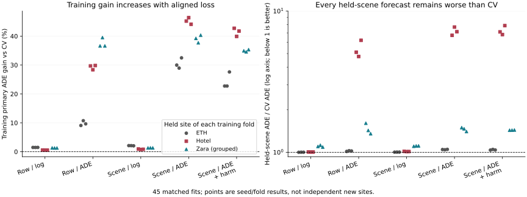

# Does Matching the Training Objective Repair Transfer?

## Material Passport

Date: 2026-09-17. Status: executed and checkpoint-replayed. Scope: fit-only
controlled training experiment, not independent confirmation or deployment.
Original approved task: eight observed / twelve predicted native annotation
steps, past-normalized ADE, equal physical-scene aggregation. Offline annotated
observations with interpolation provenance, not strictly real-time sensor input.

**Answer: no, not with this predictor and cohort.** All 45 fits completed and
all remain worse than CV on their held fit scene. Aligning the training loss
substantially improves training performance while damaging held-scene prediction.
The fixed baseline-relative harm penalty does not restore easy preservation.
The research goal remains active; this experiment does not establish the paper's
scene-level intervention contribution.

## Fixed Comparison

The earlier visual study trained with a window-average log1p(ADE) loss but was
evaluated with equal-scene untransformed ADE. I tested this discrepancy rather
than changing the evaluation metric or continuing fallback threshold searches.

All 11,966 fit windows are retained. ETH, Hotel and grouped Zara form three
physical-scene folds; seeds17/29/43 are run in every arm. The same small geometry
network consumes past trajectory, neighbor context, baseline rollouts and image
availability scalars. RGB pixels are not used in this comparison. A fast forward
path is exactly equal to the old geometry arm and removes repeated unused image
loading. Train-only constant dimensions are zeroed in every arm, including the
control. This common support treatment is not credited to the objective.

The five fixed arms each have4,000updates, batch64, AdamW learning rate0.0003,
weight decay0.0001, final checkpoint only. The harm penalty coefficient is1,
fixed before training: ADE + max(ADE_model - ADE_CV,0). It is a training penalty,
not a safety guarantee. The complete study has180,000updates and174.57seconds
summed recorded fitting time; startup, evaluation and verification are additional.
Fast execution reflects a small geometry MLP and removal of unused RGB loading,
not a reduction of the registered data, seeds or updates.

No held-scene checkpoint, threshold or model was selected. Development,
calibration and confirmation roles remain unopened in this study. The control
differs from the earlier2,000-update run in budget, sampler implementation and
common support treatment; do not attribute its change to training duration alone.

## Results

Positive gain means lower error. Aggregate gains are ratios of equal-scene,
equal-seed mean errors, not means of scene-specific percentage improvements.
CV is also the training-selected strongest of the seven candidates in every fold.

| Training arm | Primary gain vs CV (%) | Training primary gain range (%) | Perfect CV/candidate oracle, diagnostic (%) |
| --- | ---: | ---: | ---: |
| Row sampling, log1p(ADE) | -1.03 | 0.54 to 1.48 | 0.32 |
| Row sampling, ADE | -165.67 | 9.07 to 39.52 | 1.22 |
| Scene-balanced, log1p(ADE) | -1.47 | 0.75 to 2.11 | 0.36 |
| Scene-balanced, ADE | -234.53 | 28.94 to 46.40 | 1.04 |
| Scene-balanced, ADE + harm | -237.24 | 22.73 to 42.72 | 1.14 |

For example, -234.53% gain means3.3453times the reference error, not negative
trajectory error. None of45fits passes the2%easy gate. Absolute normalized easy
harm ranges are0.0288--0.3129 for the row/log control and1.2954--108.6827 for
scene/ADE+harm. Relative degradation can exceed six million percent because the
CV easy error is very small. Both relative and absolute values are preserved in
[full metrics](report.json); these failures are not dismissed as percentages.

The largest failure is Hotel: its seed-mean gains are-435.93% for row/ADE,
-618.77% for scene/ADE and-627.18% for scene/ADE+harm. Native-coordinate ADE
diagnostics are also negative for every arm/recording after averaging seeds.
Those diagnostics are calculated separately for ETH, Hotel, Zara01, Zara02 and
Zara03, not pooled into a metric-unit cross-dataset score. They do not replace
the primary and are not a standard seconds/meters leaderboard reproduction.

## What the Controlled Factors Show

- Removing log under row sampling changes held error by-162.97% relative to
  the row/log network. Training gains increase, but all three scene means worsen.
- Balancing scenes while keeping log gives-0.4380% relative to row/log. This
  correction of the weighting discrepancy does not itself improve prediction.
- Removing log under scene balancing gives-229.69% relative to scene/log.
- Adding the fixed harm penalty to scene/ADE gives-0.8114% overall relative to
  scene/ADE. Seed contrasts vary in sign; the exploratory interval includes zero.
  No reliable safety gain or deployment follows.

All comparisons use the same predictor family and update budget. Learning rate
and gradient clipping are also fixed, so these are results for this optimizer
budget, not proof that every ADE-trained or risk-regularized model must fail.

The2,000paired resamples use physical scenes, not overlapping windows. There are
only three historically used fit sites and shared training folds; the intervals
are exploratory heterogeneity summaries, not independent coverage certificates.
The row/log and scene/ADE gains versus CV have intervals[-10.39%,-0.11%] and
[-618.77%,-4.59%], respectively. Full seed/scene contrasts are retained.

## Failure Decomposition

The follow-up [decomposition](failure_decomposition.json) is explicitly post-hoc,
fit-only and frozen-prediction analysis. It does not retune or deploy a policy.

1. **False starts dominate the severe transfer error.** For the three ADE-based
   arms on Hotel, stationary-history rows account for about99.85--99.95%of total
   positive error increase. Moving-history harm is much smaller. This localizes
   the symptom; it does not identify all causal mechanisms of failure.
2. **The conditional annotation patterns differ by site.** Of81stationary-history
   ETH windows,22also have entirely static future labels; in Hotel,155of284do.
   Thus observed start frequencies in these overlapping windows are59/81versus
   129/284. These are descriptive annotations from five versus26source IDs, not
   independent estimates of pedestrian behavior or human-gold motion categories.
3. **Normalization magnifies static error, but is not the sole explanation.**
   Every exact-stationary history uses the existing0.001dataset-local scale
   floor. A small false displacement can therefore have a large normalized loss.
   The unchanged primary records this effect; separate native diagnostics also
   fail, so changing reporting units would not establish success.
4. **The optimizer learns training patterns.** Primary in-sample improvement
   rises as high as46.40%, yet every held result stays negative. With these few
   independent start/stop identities, better fitting is not useful generalization.
5. **Perfect switching still has little room.** The binary oracle rises to at
   most1.22%overall with the new candidates. It uses future labels retrospectively,
   is not executable at inference and does not justify another threshold sweep.
   The bound applies only to choosing CV or each fixed candidate, not all possible
   future models or mixtures of their outputs.

The training-gradient audit reports loss derivative coefficients, not full network
gradient importance. For example, when training without Hotel, the stationary
ETH rows contribute68.57%of row-average CV error but only0.245%of the aggregate
log-loss derivative coefficients. Removing that attenuation changes optimization
as intended; it does not supply missing state or directional information.

## Verification

- `fresh_run`:45real PyTorch fits, all final held-fit evaluations, scene-bootstrap
  analysis and frozen-prediction failure decomposition.
- `cached_verified`:the source11,966-row input cache and all hashes;45final
  checkpoints reproduce saved predictions bitwise. Completed resume performs
  zero new updates and preserves all45weights plus the main report byte-for-byte.
- Twelve focused tests pass, including matched forward computation, exact
  optimizer/RNG resume, training-only sampling, constant-feature support,
  objective gradients and correct scene-mean aggregation. The unrelated full
  legacy suite was not rerun. One initial test used overly strict floating-point
  equality; its tolerance was corrected before registration, with no model change.
- macOS arm64, Python3.11.1, PyTorch2.12.0; four compute threads, one interop
  thread, zero DataLoader workers. A100-step pilot saved and resumed without
  held evaluation. No accelerator probing, hang, duplicate job or incomplete fit.
- No new CREATE job was needed or submitted. Its earlier access/path blocker was
  not re-queried and is not presented as a fresh remote status observation.
- `not_run`:independent confirmation, new source calibration, raw-frame t+50,
  new multimodal dynamics model and deployment. No Stage5C or SMC execution.

Registration SHA256:
`277c1296ed4ed1919687721f13a28a17a36839c7f202df75577bfcb577b95610`.
Code/design committed before the main run at`cd197bbf`. Checkpoints, row caches
and predictions remain private; Git contains only code, reports and light metrics.

## Next Research Decision

Do not promote the objective-aligned predictor, add more epochs without a new
hypothesis, or call this loss penalty a safety mechanism. The loss-only repair
has been tested and failed. The next useful change must address observable state
and direction under scene shift, with broader independent start/stop support,
not just amplify the same31identities or sweep harm coefficients.

Revisit the existing past-image/motion correspondence evidence and test a
representation tied to observed motion or verified body/scene direction before
scaling visual training. Keep the established geometry control, require useful
candidate/CV headroom and evaluate any safety selector separately. If external
pretrained features are considered, first record their source and exposure
limits; they cannot silently inherit a no-leakage certification.

The eventual paper still requires matched independent-agent versus joint-scene
selection, independent calibration/confirmation support and public strong-method
comparisons. Historical Stage26/37 scores remain exploratory under the later
lineage audit. No new best-deployable claim is made. M3W remains a dataset-local
trajectory/world-state research project, not true3D or a foundation model, and
is **not yet submission-ready**.
