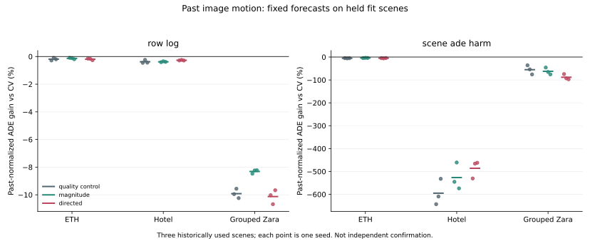

# Past Image Motion Does Not Yet Repair Forecast Transfer

## What Was Actually Run

`fresh_run`: explicit motion features from 16,106 unique observed-frame pairs,
covering all 11,966 approved fit windows. Each query retains eight observations
and twelve future labels. ETH, Hotel and grouped Zara remain three physical-site
folds. Zara03's 180 windows remain present with missing-image masks.

The extraction restores the 96-to-32 crop scale and integer recentering translation
before applying the supplied image/native coordinate convention. It uses fixed
OpenCV 4.13.0 Farneback forward/backward flow, center/ring median vectors, their
contrast and motion-magnitude quantiles. Source matrices provide dataset-local
coordinate proxies, not certified ground-plane body motion, meters or seconds.
Upstream interpolation is disclosed under offline annotated observations; there
is no strict sensor-as-of claim. No future labels are opened during extraction.

The experiment compares quality-control, magnitude and directed features under
two prespecified objectives, three seeds and three held fit folds. All 54 real
Torch models finish 4,000 updates, 216,000 total, with 196.69 seconds summed fitting
time. The small MLP operates on cached features, so it does not repeat video
decoding or CNN work each batch. This is neither a full M3W benchmark nor a large
world-model training claim. CV is training-selected strongest in every fold.

The first runner hit a duplicate-PID heartbeat error after saving a partial
checkpoint. No held prediction was produced by that version. A separately
registered v2 fixes only logging. The original failed source/registration and
400-update partial checkpoint remain available; those updates are not counted
among the 54 completed fits. The v2 pilot's 100 updates are included through resume.

## Results

Primary: unchanged past-normalized ADE, equal physical-scene and seed aggregation.
Lower error is better; negative gain means worse than CV.

| Inputs | Row/log gain vs CV | Scene/ADE+harm gain vs CV | Positive held fits | Easy gate passes |
| --- | ---: | ---: | ---: | ---: |
| Quality control | -0.996% | -226.739% | 0/18 | 0/18 |
| Add magnitude | -0.843% | -201.360% | 0/18 | 0/18 |
| Add direction | -0.972% | -188.996% | 0/18 | 0/18 |

Directional features reduce error 11.55% relative to the already failing
quality-control model under scene/ADE+harm. That is not a gain over CV. Its
exploratory paired-scene interval is [-21.23%, 15.64%], with Hotel better and Zara
worse. Direction versus magnitude is +4.10%, interval [-16.07%, 6.46%]. Under row/log,
direction versus quality is only +0.023%, interval [-0.189%, 0.106%], and direction
is worse than magnitude. No stable directional contribution is demonstrated.

All 54 easy gates fail. Relative easy degradation spans 208.54% to 5,719,454.30%;
small denominators are a major scaling issue, but absolute normalized easy harm
also spans 0.0277 to 102.7747. These are uncontrolled forecasts, not deployable safety
policies. No switch threshold was selected to disguise the damage.

Training primary improvement reaches 52.59%, so there is actual optimization.
It does not transfer:every arm/recording seed-mean native-coordinate diagnostic
is also negative, with no pooling of unverified units. Even the retrospective
perfect binary CV/candidate chooser gains only 0.31--1.37% overall across the six
fixed candidate sets. It is an oracle diagnosis, not an inference input/result.

## Why This Repair Failed

1. **Stationary support is still small and shifted.** Only five ETH and 26 Hotel
   source IDs have exactly stationary histories: 81 and 284 overlapping windows.
   Zara has none. There are no new independent start/stop scenes in this study.
2. **Feature support does not transfer cleanly.** Under training-only
   normalization, 88.89% of held stationary ETH rows and 71.83% of held stationary
   Hotel rows exceed the fixed ten-standard-deviation range in at least one
   motion feature. Clipping is unchanged and cannot create missing evidence.
3. **Consistent flow is not future intent.** Center consistency is 98.57--99.78%
   where images exist, yet the simple last-center motion-magnitude score has
   descriptive departure AUROC 0.674 (ETH) and 0.586 (Hotel). These are post-fit,
   overlapping-window diagnostics, not independent classifier validation. The
   signal includes body motion, background, occlusion and annotation effects;
   it is not a pose or intention label.
4. **Amplifying error still invents movement.** Hotel stationary-history rows
   account for 99.75--99.95% of positive error increases in ADE+harm arms. The
   unchanged small past scale makes this failure especially costly. Loss and
   flow improvements do not establish accurate departure direction.
5. **Damage reduction is not positive prediction.** The favorable comparison
   to a damaged neural control changes sign across scenes and never exceeds CV.
   This does not prove vision or stronger representation learning cannot help;
   it falsifies these fixed summaries, model and training budgets.

## Verification and Limits

`cached_verified`: 54 checkpoint inference replays exactly match saved predictions.
Completed-run resume performs no new updates and preserves 54 weights and the main
report byte-for-byte. Independent input extraction matches both array hashes.
13 focused tests pass, including synthetic image translation, crop compensation,
source axes, past-only joins, missing images, arm censoring and optimizer/RNG
resume. The unrelated full legacy suite was not rerun. CPU 4/interop 1/workers 0,
arm64 Python 3.11.1, loaded Torch 2.12.0; no NumPy training fallback.

Two thousand paired scene-bootstrap draws and three seeds are complete. There
are only three historically explored scene clusters, with shared training folds.
Intervals are exploratory, not independent confirmation or formal safety coverage.
Development, calibration and confirmation remain closed. No new deployment,
Stage5C execution, SMC, metric/seconds, foundation or true 3D claim follows.

## Next Decision

The most valuable remaining repair is supported observation of state change,
not another threshold/loss grid on these fixed predictions. First distinguish
person motion from crop/background/annotation noise at the original observed
resolution and check independent start/stop support in existing authorized
training assets. Any new source admission or protocol change must be explicit;
do not open sealed roles or silently replace the approved primary metric.

The broader proposed contribution remains scene-level baseline-relative joint
intervention, which still needs genuinely useful candidate predictions and
independent risk evidence. This result is not submission-ready evidence for that
claim. Historical Stage26/37 gains remain exploratory after the lineage audit.

Artifacts:[input audit](input_report.json),[all54 results](report.json),
[failure decomposition](failure_diagnosis.json),[verification](verification.json),
[registered decision](../observed_motion_decision.md),
[runtime-only repair](../observed_motion_runtime_repair.md).
