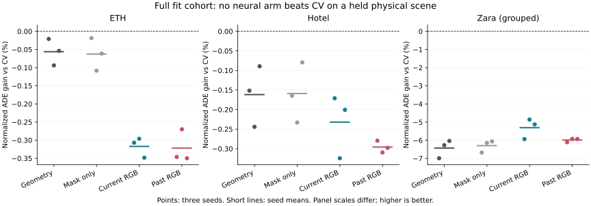

# Full Fit-Cohort Offline Visual Forecasting

## Decision and Scope

I tested whether broader observed motion and image context could supply the
predictive information missing from the earlier stationary-start experiments.
The user delegated the observation-route decision. I adopted conventional offline
annotated forecasting, while preserving the approved eight observed / twelve
predicted native annotation-step task, past-normalized ADE, physical-scene folds
and data roles. Retrospective interpolation is disclosed: this is not a strict
sensor-as-of or online-causality experiment. Raw-frame t+50 remains supplementary
and was not evaluated in this study.

**Result: all 36 neural fits completed; none beats the training-selected motion
baseline on its held fit scene. No new deployment or submission-ready claim.**
This is a completed negative information-value study, not an independent final
test, a medium/full M3W training claim, or proof that visual forecasting is
impossible. The overall research goal remains active.

## What Was Actually Run

- All 11,966 eligible fit windows: ETH 2,614, Hotel 1,197, Zara01 2,234,
  Zara02 5,741 and Zara03 180. No row was dropped for missing imagery.
- Three physical-scene folds: ETH, Hotel and grouped Zara. The three Zara
  recordings are not counted as three independent sites.
- Seeds 17, 29 and 43; geometry, coverage-mask-only, current-RGB and past-RGB
  arms. Each final checkpoint follows 2,000 fixed AdamW updates, batch size 64.
- A small CNN supplies appearance features to a trajectory MLP with an
  exactly CV-initialized residual. This is not a new Transformer/JEPA result.
  The geometry arm includes scalar image-availability indicators; the mask-only
  arm additionally controls for spatial crop coverage without RGB information.
- Arm initialization, minibatch streams, fitting budgets and final-update
  evaluation rules are matched. No held-scene checkpoint or threshold selection.
- 72,000 optimizer updates; summed recorded fitting time 1,948.53 seconds
  (32.48 minutes), not total end-to-end elapsed time. Native arm64 PyTorch,
  CPU four threads, interop one, DataLoader workers zero. No NumPy fallback.
- Students development, calibration and confirmation roles were not opened
  for fitting, model selection or evaluation. Integrity checks may hash source
  files without admitting their records to a role reader.

Registration SHA256:
`0ab1fb0a6c505e540e6f6d2a6679b0d72df38387deaf618f8413ef8f4ebbaca4`.
The registration and source bindings were frozen before the main run.

## Main Results

Positive gain means lower error. Aggregate gains are ratios of equal-scene,
equal-seed mean errors, not averages of per-scene percentages. Constant velocity
was selected from seven baselines using only the two training scene means in
every seed/fold; CV and training-selected-strongest comparisons coincide here.

| Arm | ADE gain vs CV (%) | Training log-loss reduction range (%) | Perfect CV/candidate chooser gain, diagnostic (%) |
| --- | ---: | ---: | ---: |
| Geometry | -0.5767 | 3.87 to 13.79 | 0.3083 |
| Coverage mask only | -0.5692 | 3.87 to 13.80 | 0.3086 |
| Current RGB | -0.6627 | 4.98 to 14.44 | 0.2069 |
| Past RGB | -0.7401 | 5.98 to 14.91 | 0.1887 |

The last column uses held future labels only for a retrospective oracle. It is
not an inference model, a learned gain, or a bound on different future models.
For each fixed candidate, however, no gate choosing only that candidate or CV
can exceed its oracle on these rows. More threshold searches cannot create
substantial missing candidate quality.

All 36 held-scene comparisons degrade the predefined easy subset. Relative easy
degradation ranges from 170.84% to 6,449.88%, with absolute past-normalized ADE
harm from 0.02270 to 0.16877. The large percentages partly reflect very small CV
easy errors; the positive absolute harm remains a real failure. No 2% easy gate
passes. No model is promoted because its aggregate deterioration looks small.

The panels use different vertical ranges. Points are training seeds, not
independent new sites. Detailed results: [main metrics](report.json),
[paired analysis](paired_analysis.md), [training-fit diagnosis](training_fit_diagnostic.json).

## Is There Visual Lift?

Relative to the geometry network, current RGB gives -0.0855% overall, with an
exploratory 95% paired scene-bootstrap interval [-0.2608%, +1.0561%]. Past RGB
gives -0.1625%, interval [-0.2657%, +0.4194%]. Both contrasts are negative for
all three aggregate seed results. Zara alone is less damaged with current RGB
(+1.0561% versus geometry), but remains worse than CV. That is not baseline lift.

The 2,000 paired resamples use the three physical-scene clusters rather than
overlapping windows. Three historically used fit sites and overlapping training
folds are insufficient for an independent generalization certificate. These
intervals describe heterogeneity within the fit study, not confirmed population
coverage or formal deployment safety.

## Failure Taxonomy and Tested Repair

1. **Training fit does not transfer.** Every checkpoint lowers the full training
   log-loss relative to CV; training equal-scene primary gain ranges from 0.43%
   to 1.53%. Every held result is negative. This supports a generalization or
   information-support problem, rather than an unexecuted optimizer. It does
   not distinguish overfitting from all possible input/model deficiencies.
2. **Independent support is much smaller than window count.** The 365 exact
   stationary-history windows still come from five ETH and 26 Hotel source
   IDs. They account for 89.37% of the equal-scene CV primary error. The broader
   moving cohort does not add independent support for this dominant failure.
   The approved primary metric is not changed to hide this concentration.
3. **An unsupported constant-feature direction is real, but not sufficient.**
   For the ETH holdout, raw horizon/step metadata are constant in training and
   different in ETH. A frozen-model diagnostic replaces exactly constant
   training columns with their training value; training inputs are unchanged.
   Overall gains become -0.5614%, -0.5517%, -0.6521% and -0.7286% in arm order.
   All remain negative; two ETH RGB trials worsen. The original main result is
   preserved. This adaptive fit-only control is not a new validation-selected
   model or a causal attribution of the whole failure.
4. **The residual introduces false movement.** Easy harm is positive throughout.
   CV initialization alone does not preserve a useful floor after optimization.
   A selector cannot repair the very small binary candidate/CV headroom.
5. **Visual temporal representation remains unproven.** Concatenating small
   crop latents did not establish a benefit from eight past images. Orientation
   correspondence, motion representation and label timing remain possible
   mechanisms, not diagnosed causes. The result does not rule out better visual
   encoders or genuinely informative independent contexts.

The constant-support rule was specified and hash-bound before its diagnostic
evaluation, after the main experiment had started. It is explicitly post-hoc
relative to the main protocol. See [decision](constant_support_decision.md) and
[all 36 controls](constant_support_diagnostic.json).

## Verification and Provenance

- `fresh_run`: 36 actual neural fits, held-fit evaluation, 2,000 scene resamples,
  all-row source/feature replay, training-fit inference and support diagnostic.
- `cached_verified`: all 36 final checkpoints reproduce saved predictions
  bitwise. Completed-run resume performs zero new optimizer updates; all 36
  checkpoint files and the main report remain byte-identical.
- All 11,966 geometry vectors and image/history row joins replay exactly.
  Input arrays are 157,241,442 bytes. ETH/Hotel media conversion was fresh;
  existing Zara masked inputs were reused with schema/hash/row verification.
- 107 focused tests passed, plus two new constant-feature support tests. The
  unrelated full legacy suite was not rerun. Real fitting and checkpoint replay
  are separate evidence from unit-test success.
- Future target tensors are separate from the input allowlist. No central
  velocity or test-derived goals were added. Upstream retrospective annotation
  interpolation remains a disclosed limit to strict online causality.
- `not_run`: new independent confirmation, source-calibrated physical timing,
  metric calibration, raw-frame t+50, large-model/HPC training and deployment.
  No CREATE job was submitted; the earlier access/path blocker is unchanged.

Source weights, images, arrays and per-row predictions remain local and ignored
by Git. Reports, configurations, original aggregate figures and code are public.
The [runbook](../local_create_runbook_zh.md) gives replay and resume commands.

## Next Highest-Value Step

Do not scale this CNN or retune its fallback first. A new fit-only experiment
needs a predictor with demonstrable directional headroom on the stationary-start
and worst-scene cases before a joint intervention policy can have a useful job.
Test a compact observed-motion representation and training-objective repair
against the same geometry/CV controls, with explicit stopping/starting state and
unchanged primary evaluation. Fix unsupported metadata by construction in that
new registration, not by overwriting this one. Retain modality contributions
only when matched ablation supports them.

Broader independent start/stop scenes are also required: 31 source IDs at two
sites cannot establish general safety. Do not relabel exposed fit scenes as
confirmation, or open held confirmation to select a visual encoder. The core
paper contribution remains baseline-relative, scene-level intervention with
independent risk calibration; neither CV-plus-network switching nor a CNN alone
is novel. See the [primary-source positioning](literature_positioning.md).

Historical Stage26/37 scores remain exploratory under the later lineage audit;
they cannot serve as certified deployment evidence for this changed task.
No deployment change, Stage5C execution, SMC, metric/seconds, true-3D or foundation
claim follows from this experiment. The project is **not yet submission-ready**.
