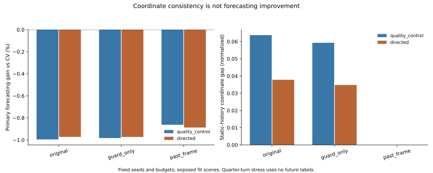

# Past-Only Frames Fix Coordinate Consistency, Not Forecasting

## Result

The matched experiment completes 36 new neural fits and 18 exactly replayed
controls. Past-only frame conditioning removes the measured quarter-turn
disagreement and slightly reduces prediction damage relative to a matched
guard-only network. It still does not beat causal CV. All 36 fresh held fits are
negative on the primary endpoint; none passes positive gain plus easy preservation.
No new model is deployed or promoted to a submission candidate.

| Features | Arm | Primary gain vs CV (%) | Gain vs matched guard (%) |
| --- | --- | ---: | ---: |
| Quality control | Original | -0.99582 | -0.01269 |
| Quality control | Guard only | -0.98300 | 0.00000 |
| Quality control | Past frame | -0.86256 | 0.11928 |
| Directed motion | Original | -0.97244 | 0.00057 |
| Directed motion | Guard only | -0.97302 | 0.00000 |
| Directed motion | Past frame | -0.88781 | 0.08440 |

The past-frame directed seed gains are -0.92311%, -0.86528%, -0.87503%.
Its descriptive 2,000-draw three-scene interval is [-8.41093%, -0.18064%]. Quality
control has seed gains -0.85287%, -0.84036%, -0.89443% and interval
[-7.93481%, -0.16427%]. These scenes were previously explored; intervals are not
independent confirmation or risk guarantees.



## The Controlled Change

The original source adapter aligns nonzero current ego velocity with its x-axis.
When current velocity is zero, it chooses zero heading. A new target-free frame
instead uses the latest nonzero past ego velocity, then a nearest supported moving
neighbor, then a relative neighbor position. Every selected observation is past
or current. No labels, identities, scene IDs or future endpoints choose direction.

Across all 11,966 queries, the anchors are:

- Ego past velocity: 11,601.
- Neighbor past velocity: 354.
- Neighbor relative position: 3.
- No anchor: 8, with exact causal-CV fallback and no row removal.

The 365 exactly-static histories consist of the last three categories. Existing
typed position, velocity, baseline and directed image-motion vectors rotate into
this frame. Scalar/mask/coverage columns stay unchanged. Residuals rotate back
before adding the unchanged baseline. Training moments use training rows only.
The feature width and parameter count do not grow.

Guard-only training has the same eight-row no-anchor fallback but retains the
original axes. It separates that fallback from frame conditioning. Both new arms
use the old log1p-ADE objective, seed/batch sequence and 4,000-update budget.
The final checkpoint is fixed; no threshold/epoch/model is selected on held
outcomes. The [training decision](../past_frame_decision.md) was committed before
the first fit. A 400-step pilot resumed without opening held evaluation.

## Coordinate Test Scope

For each held feature array, rotate vector quantities and baseline paths by
90/180/270 degrees, predict, and restore the result. The supplementary static-only
analysis reads no target array and checks 365 static queries per model seed.
Mean static-history prediction gaps, averaged over the six supported seed/fold
summaries per condition, are:

| Features | Original | Guard only | Past frame |
| --- | ---: | ---: | ---: |
| Quality control | 0.0637274 | 0.0592853 | 0.0000000 |
| Directed motion | 0.0378309 | 0.0347920 | 0.0000000 |

These are normalized prediction disagreements, not truth-based forecasting errors.
The grouped-Zara fold has no exactly-static histories; it does not provide static
support or a passing static test. Zero gap holds for the tested quarter turns.
Unit tests also check the coordinate algebra at a non-cardinal angle; this is not
an empirical audit of every rotation or of raw-image augmentation.

Importantly, moving ego inputs are already heading-aligned by the original source
pipeline. Arbitrarily rotating their already-aligned features bypasses that input
convention. Overall feature-stress gaps cannot be used to claim the original
moving-source pipeline violates equivariance. Separate tests show this distinction.
The narrower static-history coordinate ambiguity is the relevant diagnostic.
This work does not replace or contradict the earlier fixed-head EqMotion study.

## What Still Fails

- Directed past-frame static-to-movement gains are negative in all six supported
  held slices. On ETH they are approximately -0.00020 to -0.00050%; on Hotel,
  -0.03071 to -0.05612%. Consistent axes do not supply launch intent/direction.
- Static-stay CV is perfect. New directed predictions have normalized ADE
  0.00247--0.11261 on these held slices. Percentage gains for a zero-error CV
  subset are undefined; the positive absolute drift must remain visible.
- Directed easy degradation spans 245.13--6,832.04%, with mean absolute normalized
  easy harm 0.03258--0.17877 across the nine held fits. Near-zero easy reference
  errors amplify ratios but do not remove the positive absolute harm.
- Directed image-motion features do not produce an aggregate lift over the
  quality-control past-frame arm. No visual-information contribution follows.
- Slight improvement over another failing neural control is not success against
  the causal baseline or the paper's safety requirements.

The data support a limited conclusion: coordinate conditioning repairs a
representation inconsistency, but not the dominant forecasting failure. They do
not identify a uniquely sufficient new cue or prove all geometric architectures
will fail. The next experiment needs evidence of transferable state-change
information and independent support, not another axis or threshold sweep.
Auxiliary SDD admission is still unresolved; this result does not authorize it.

## Provenance and Reproduction

`fresh_run`: 36 native arm64 Torch fits, 144,000 updates, 114.58 summed fitting
seconds; target-free per-query coordinate diagnostics. This is a matched small
experiment, not full-scale training. Four CPU threads, one interop thread, single
process, no loader workers. Optimizer/RNG checkpoints and heartbeat every 400 steps.

`cached_verified`: 18 frozen controls, source/feature schemas, original hashes
and all 54 checkpoint predictions. Full inference replay is exact. Completed
resume performs zero updates and preserves 109 weights/predictions/report hashes.
Twenty-four focused tests pass; the full legacy suite was not rerun. All relevant
processes exited with code 0. No new CREATE access attempt or job was needed.

All 11,966 approved fit rows, eight-observed/twelve-predicted annotation steps,
past-normalized ADE and equal physical-scene aggregation are unchanged. Students,
development, calibration and confirmation remain closed. Offline annotated
histories may contain retrospective interpolation. No strict sensor-as-of,
metric/seconds, true-3D, foundation, deployment, Stage5C or SMC claim.

Geometric equivariance is established prior work, including
[EqMotion](https://arxiv.org/abs/2303.10876). The author abstract was checked in
this pass; direct CVF page/PDF requests returned 403, so no new full-paper review
is claimed. The simple coordinate control is not offered as architectural novelty.

```bash
.venv-pytorch/bin/python scripts/run_m3w_past_frame.py --registration configs/m3w_past_frame.json
.venv-pytorch/bin/python scripts/run_m3w_past_frame.py --registration configs/m3w_past_frame.json --replay
.venv-pytorch/bin/python scripts/analyze_m3w_past_frame.py
.venv-pytorch/bin/python -m pytest tests/test_m3w_frame_scope.py tests/test_m3w_past_frame.py tests/test_m3w_residual_range.py tests/test_m3w_objective_alignment.py tests/test_m3w_offline_visual_forecast.py -q
```

Commands need the original private, hash-bound data and model controls. Public
outputs contain aggregate metrics and original charts, not caches or weights.
[Metrics](report.json), [replay](replay.json), [resume](resume_check.json),
[static-only diagnostics](analysis.json).
