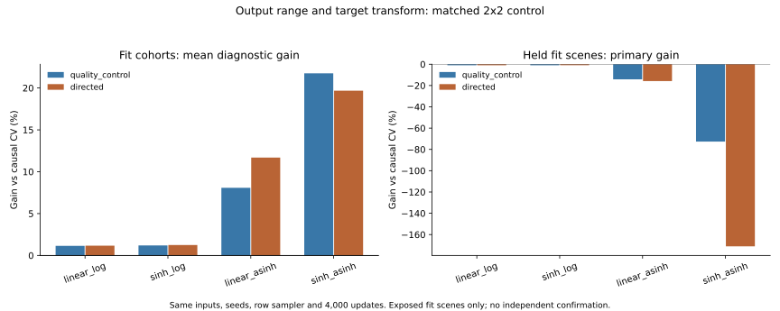

# Easier Fitting Does Not Repair Cross-Scene State-Change Prediction

## Finding

The completed residual-range experiment is negative. A target transform improves
fit-cohort ADE but worsens previously exposed held fit scenes and damages easy
cases. None of the 54 fresh neural fits improves the complete held-scene primary;
none passes positive improvement plus the 2% easy-preservation requirement.
No new model is deployed or promoted to a submission candidate.

| Features | Readout / training loss | Mean fit-cohort gain (%) | Held primary gain (%) |
| --- | --- | ---: | ---: |
| Quality control | linear / log1p ADE | 1.14496 | -0.99582 |
| Quality control | sinh / log1p ADE | 1.19413 | -0.95875 |
| Quality control | linear / asinh SmoothL1 | 8.07671 | -14.17415 |
| Quality control | sinh / asinh SmoothL1 | 21.74958 | -72.66424 |
| Directed image motion | linear / log1p ADE | 1.16540 | -0.97244 |
| Directed image motion | sinh / log1p ADE | 1.24148 | -0.90994 |
| Directed image motion | linear / asinh SmoothL1 | 11.68864 | -15.79533 |
| Directed image motion | sinh / asinh SmoothL1 | 19.68028 | -171.03448 |

Fit-cohort figures are arithmetic means of nine overlapping training-fit gain
diagnostics, not independent estimates. Held primary figures use the registered
equal-physical-scene and seed aggregation. Training and held columns therefore
describe different populations and aggregation; neither is an untouched test.



## What Changed

The frozen [decision](../residual_range_decision.md) defines a 2x2 design. The
input variants, network parameters, zero-CV initialization, row sampler, three
seeds, three folds and 4,000 updates per fit match the old controls. Only the
residual readout and/or the supervised loss change:

```text
linear prediction: baseline + z
sinh prediction: baseline + sinh(clamp(z, -12, 12))
log objective: mean_i log(1 + ADE_i)
asinh objective: SmoothL1(asinh(prediction-baseline), asinh(target-baseline))
```

The target is used only for supervised loss/evaluation. Inference consumes no
future label. The asinh target is not clipped. The cap on raw sinh outputs is
solely a numerical guard, not a physical bound or a safety mechanism. Both
readouts are CV at initialization and have unit derivative there. The original
past-normalized ADE remains the primary; training surrogate values are not
comparable between objectives.

## Failure Mechanism

1. **Output range alone is not enough.** Directed sinh/log reduces negative
   primary gain from -0.97244% to -0.90994%, but all three seeds remain negative
   (-0.86796%, -0.91058%, -0.95128%). The three-exposed-scene descriptive interval
   is [-9.28525%, -0.19570%]. This is damage reduction, not improvement over CV.
2. **Changing supervision makes training state changes more learnable.**
   Directed linear/asinh gains 9.36--15.49% on pooled training static-history
   errors, versus 0.013--0.084% for linear/log. This is evidence of a training
   optimization effect under the fixed budget, not proof of transferable cues.
3. **The effect does not transfer.** Every evaluable held static-to-movement
   slice for directed linear/asinh is negative: roughly -0.20 to -0.53% on ETH
   and -10.98 to -13.48% on Hotel. There are no exactly-static histories in the
   held grouped-Zara fold; absence is not a passing result.
4. **Static-stay predictions drift.** Directed linear/asinh gives normalized
   ADE 5.72--8.83 on held static-stay slices whose CV error is exactly zero.
   Directed sinh/asinh reaches 5.03--456.13. Percentage improvement for the
   zero-error slice is undefined, so those absolute errors must be shown.
5. **Expansive readout amplifies scene/seed failures.** Directed sinh/asinh
   primary seed gains are -21.46%, -478.60%, -13.04%. Its mean must not conceal
   the worst seed. Training has zero cap-hit coordinates in that feature arm,
   but held inference has seven. Quality-control sinh/asinh records eleven
   training cap-hit coordinate evaluations and one at held inference. These
   are coordinate evaluation counts, not counts of independent failed people.
6. **The result is not only a primary-scale artifact.** Mean per-recording
   native-coordinate gains remain negative for the directed transformed arms
   on all five recordings. Those diagnostics are kept separate by recording;
   units are not pooled or described as verified metric units.

Easy degradation also fails throughout. Directed sinh/log's nine-fit range is
218.56--7,888.70%, with normalized mean absolute easy harm 0.0290--0.2064.
Directed linear/asinh is 7,982.64--348,876.21%, absolute harm 0.6530--6.2691.
Directed sinh/asinh is 9,541.65--17,806,351.10%, absolute harm 0.2497--319.9681.
Ratios are large partly because the baseline is nearly exact on easy rows;
this is not permission to hide their positive absolute harm or change the gate.
All raw per-fit results, including quality controls, are in [analysis.json](analysis.json).

## What the Experiment Supports

There is a real optimization bottleneck in learning large normalized residuals,
but addressing it does not by itself solve cross-scene forecasting. The current
inputs/support allow better fitting without reliable held-scene start direction
or static-stay preservation. This is consistent with overfitting and insufficient
transferable information, not proof of a universal impossibility result.
It does not isolate which missing cue would fix the task, nor establish that
more independent source scenes alone would be sufficient.

Do not launch another readout/loss grid on the same exposed folds or present
better fitting as neural contribution. The next useful change must add or verify
transferable state-change information and independent training support. Pending
auxiliary SDD admission remains a separate scientific decision; this experiment
does not authorize silently adding it or opening sealed roles.

## Reproduction and Boundaries

- `fresh_run`: 54 native arm64 Torch fits, 216,000 optimizer updates, 196.26 seconds
  summed fit time, including the resumed 400-step pilot. This is an actual small
  matched experiment, not full-scale world-model training or a long run.
- `cached_verified`: 18 original controls, source arrays, annotation lineage,
  input feature cache, original checkpoint identities and exact predictions.
- All 72 checkpoint inferences reproduce exactly. Completed resume makes zero
  updates and leaves 145 checkpoint/prediction/report hashes unchanged.
- Twenty-two focused tests pass, including exact old-control training and split
  versus uninterrupted optimization. The full legacy suite was not rerun.
- CPU four threads, interop one, no loader multiprocessing. Each fit checkpoints
  every 400 steps with optimizer and RNG state; heartbeat records PID/progress.
  Processes exited normally. No new CREATE job, crash or silent fallback.
- All 11,966 fit rows and ETH/Hotel/grouped-Zara folds remain. Historical exposure
  is retained. Students/development/calibration/confirmation remain closed.
- Offline annotated histories may use retrospective interpolation. No strict
  sensor-as-of, metric/seconds, true-3D, foundation, deployment, Stage5C or SMC claim.

```bash
.venv-pytorch/bin/python scripts/run_m3w_residual_range.py --registration configs/m3w_residual_range.json
.venv-pytorch/bin/python scripts/run_m3w_residual_range.py --registration configs/m3w_residual_range.json --replay
.venv-pytorch/bin/python scripts/analyze_m3w_residual_range.py
.venv-pytorch/bin/python -m pytest tests/test_m3w_residual_range.py tests/test_m3w_track_event_sampling.py tests/test_m3w_objective_alignment.py tests/test_m3w_offline_visual_forecast.py -q
```

These commands require the private hash-bound source caches and controls; a
public clone does not include them. See [full training report](report.json),
[exact replay](replay.json), [completed-resume check](resume_check.json).
