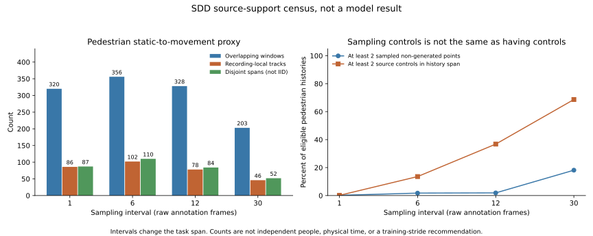

# SDD State-Change Support Census

## Material Passport

2026-09-17, descriptive source-support diagnostic. Full local annotations were
read and computed again; no forecast model, sampler or threshold was fitted.
No new scientific data role was admitted. The goal remains active and not
submission-ready. This census informs the pending auxiliary-source decision,
not a change to the current main task, primary metric or sealed roles.

The result source is `fresh_run`: 60 recordings, 10,616,256 rows and 10,300
recording-local track IDs. The pilot is reused with its verified identity and
the other 59 recordings are newly computed in the full invocation. Summed
per-record computation is 35.85 seconds, including the pilot. A second full
source computation reproduces every scientific count exactly, preserving the
original receipts. It is reproducibility evidence, not an independent dataset.

## Why This Check Matters

The preceding ETH/UCY experiments did not establish useful forecasts for rare
state changes. Adding many highly overlapping SDD windows might increase the
number of optimization examples without adding much support for that failure
mode. We therefore count windows, recording-local tracks and disjoint event
spans separately. None alone certifies statistically independent people/events.
The dataset authors describe eight scene locations; 60 videos must not be
treated as 60 independent calibration scenes. [Dataset source](https://cvgl.stanford.edu/projects/uav_data/).

## Fixed Rules, Not a New Training Protocol

`configs/m3w_sdd_state_support_audit.json` was written before the census.
Its SHA256 is
`9339593706eeec61c2e0affbc64bc593c1875c1d1d80953392def071a90bec0c`.
The diagnostic evaluates raw annotation-frame strides 1, 6, 12 and 30,
anchored at video frame zero. These create different observation/future spans;
they are not interchangeable physical-time tasks or competing accuracy results.
No stride is selected by this report.

At each query, eligibility requires eight available non-lost past states.
Twelve future states are sought **only for descriptive labels**. Missing/lost
future states do not erase eligible inputs. For example, stride 12 has 481,900
eligible histories but 372,617 complete non-lost future labels across agent
types; the other 109,283 remain in the input-eligibility denominator.

The scale is the median bounding-box diagonal over the past eight observations,
not a metric distance. Proxies are fixed as follows:

- Exact static to movement: all eight past box centers are identical, followed
  by a maximum future displacement of at least half the past scale.
- Near static to movement: past path length is at most 0.1 scale, followed by
  the same future displacement requirement. This includes exact-static events.
- Moving to stop: past path is at least 0.5 scale, and the path over the final
  four future points is at most 0.05 scale.
- Turn: past and future paths each exceed 0.5 scale; direction over the final
  three increments changes by 45 to less than 135 degrees. Reversals of at
  least 135 degrees are recorded separately.

These are annotation-derived proxies, not adjudicated human behavior labels.
They may reflect box jitter, interpolation or changing visibility. Occluded
counts are reported separately; events are not silently discarded to improve
the apparent quality. Classes overlap and must not be summed as unique events.

## Pedestrian Support

| Raw-frame stride | Eligible histories | Complete future labels | Exact-start windows | Exact-start track IDs | Disjoint exact-start spans |
| --- | ---: | ---: | ---: | ---: | ---: |
| 1 | 4,056,534 | 3,991,980 | 320 | 86 | 87 |
| 6 | 645,048 | 585,155 | 356 | 102 | 110 |
| 12 | 304,923 | 249,384 | 328 | 78 | 84 |
| 30 | 102,611 | 59,551 | 203 | 46 | 52 |

Disjoint spans are selected greedily within each source track and cover the
inclusive interval from query minus seven strides to query plus twelve strides.
They reduce obvious overlap, not shared-scene dependence or possible repeated
identities across videos. Counts at different strides overlap and cannot be
added to construct a larger independent sample.

| Raw-frame stride | Near-start track IDs | Stop track IDs | Turn track IDs |
| --- | ---: | ---: | ---: |
| 1 | 243 | 158 | 101 |
| 6 | 371 | 853 | 1,744 |
| 12 | 266 | 798 | 1,612 |
| 30 | 151 | 392 | 907 |

SDD offers substantially more annotated turns and stops under some diagnostic
spans than exact-static starts. That is an inventory finding, not evidence that
a transferred neural predictor will learn them or preserve easy cases. In
particular, the stride-12 exact-start count is only 78 source IDs despite nearly
250,000 complete pedestrian windows. These event definitions differ from the
previous ETH/UCY stationary-history diagnosis, so a direct 31-versus-78 sample
size or performance comparison is not justified.

Full agent-type, source recording and scene breakdowns are retained in
[audit.json](audit.json). There are 5,232 pedestrian, 4,210 biker, 292 skater,
174 cart, 316 car and 76 bus track IDs. Mixing them without an explicit task
and sampling choice would confound auxiliary-source and agent-type effects.

## Interpolation and Temporal Support

10,445,131 of 10,616,256 rows (98.388%) have the source `generated` flag. The
local OpenTraj SDD README defines this flag as automatic interpolation; its hash
is bound in the audit. Only 171,125 rows have that flag unset, and 141,900 of
those are non-lost. There are 2,328 tracks with at least 20 non-lost ungenerated
rows, including 1,289 pedestrian tracks. These control rows are not human gold,
and their irregular spacing is not a standard 8-to-12 benchmark protocol.

Consecutive source-control gaps have median 30 raw frames, 90th percentile 160,
99th percentile 500 and maximum 531. This is annotation cadence, not verified
video FPS or physical time. All generated rows can be bracketed by source
ungenerated rows, but only 69.81% reproduce all box edges within two pixels under
simple linear interpolation between the nearest controls. The exact source
interpolator is not established; nearest-control bracketing does not by itself
prove the true computational ancestry of every box.

For stride 12, 467,639 of 481,900 eligible histories contain a generated point
with a following source control after the query. This is a **potential
post-query-control diagnostic**, not a newly proved lineage leak for every row.
The existing offline-annotated observation disclosure remains necessary.
No strict sensor-as-of or per-frame independently observed geometry claim is
made.

An important counter-check distinguishes sampled controls from source controls
inside the past interval. For pedestrian stride 12, only 5,802 histories (1.90%)
contain two ungenerated points among the eight **sampled** observations, but
112,175 histories (36.79%) have at least two source controls somewhere inside
the observation span. The unsampled controls are not automatically absent.
The [separate source-control census](control_span_coverage.json) prevents using
sampling aliasing as proof that 98% of histories lack multiple controls.

## Verification and Boundaries

57 focused tests pass, including hand-constructed starts/stops/turns, missing
future labels, source frame gaps, scale invariance, occlusion and the distinction
between sampled versus in-span controls. The full legacy suite was not rerun.
635 eligible real-track checks mutate or truncate future rows without changing
the earlier eligible queries or their past features. Future event labels and
control-provenance diagnostics are separate from the past-feature API.

The second full census matches all 60 original receipts exactly apart from
runtime duration. It uses the same implementation; it does not constitute
independent semantic validation. The aggregate figure was rendered and inspected.
Matplotlib used a temporary cache after a local font-cache permission warning;
the process completed successfully. No source images, trajectories or data
cache are published with the light reports.

These previously exposed SDD recordings are not an untouched test set. The
current ETH/Hotel/grouped-Zara fit, eight-observation/twelve-future main task,
past-normalized ADE and sealed development/calibration/confirmation roles are
unchanged. Native source frames are not seconds, bounding-box scales are not
meters, and this remains a dataset-local 2.5D research track. No Stage5C or SMC
execution, model deployment or new neural contribution is claimed.

## Decision Implications

1. Uniformly multiplying adjacent-frame windows is not a justified remedy for
   the rare-state-change failure. A future admitted study should control source
   track contribution and report start/stop/turn support separately.
2. Auxiliary transfer should separate agent types and conditioning timescales.
   The four stride counts inform prospective design but do not select a winner.
   A source-admission/sampling decision is still pending; this report is not
   authorization to pool SDD into the current fit or open a sealed role.
3. Any benefit must be measured by a matched training comparison with and without
   auxiliary support, keeping primary evaluation fixed. No benefit is inferred
   from this census. Independent confirmation and the main method contribution
   remain missing.

Artifacts: [source counts](audit.json), [full recomputation](verification.json),
[control-span counts](control_span_coverage.json), [aggregate figure](source_support.svg).
