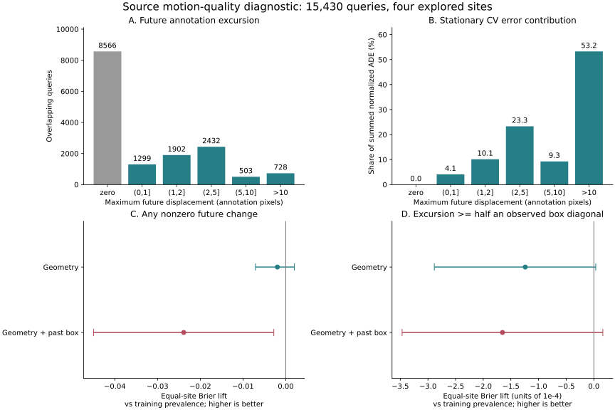

# Source Motion Quality and Past-Box Information

## Result

The registered diagnostic is complete, but it does not supply a better forecast
or deployment policy. All 15,430 source queries align to raw SDD annotations.
Forty-eight fresh, fixed probability probes find no stable out-of-site Brier
improvement from the tested geometry or added past-box features. The previous
neural failure cannot be explained simply by small annotation changes: queries
with excursions above 10 pixels contribute 53.25% of stationary CV error, and
both frozen neural families still lose on that slice.

This is training-side development, not independent confirmation, the full
8-to-12 benchmark, or a new raw-frame t+50 result. All four sites were previously
explored. No model, gate threshold, cohort or primary protocol is selected here.

## What Was Actually Run

| Evidence | Source and scope |
| --- | --- |
| Raw alignment and magnitude/provenance analysis | `fresh_run`; 15,430 overlapping queries, 545 scoped agents, 29 recordings, four sites |
| Probability learning | `fresh_run`; four held-site folds x three seeds x two labels x two input arms = 48 ExtraTrees fits |
| Previous neural trajectories and costs | `cached_verified`; unchanged producer-excluded control and motion-loss checkpoints/OOF receipts |
| Exact model replay and completed-resume check | `fresh_run`; all 48 exact, 149 artifacts unchanged, zero new fits on resume |
| Main/sealed evaluation and bookstore forecast | `not_run`; deliberately excluded from this training-side diagnostic |
| Human/video motion validation and a semantic visual predictor | `not_run`; this run uses annotations and past geometry, not human motion gold |
| New neural training or deployment | `not_run`; forests are probability probes, not Torch dynamics models |

Pre-computation registration commit `bb206551`; fixed seeds 17/29/43. Eight
observed and twelve predicted annotation steps, stride 12 raw annotation frames.
The query cohort has constant observed centers. Units remain annotation pixels;
no verified seconds, homography, physical safety or metric claim.

## How Much Motion Is In The Labels?

| Maximum future excursion, pixels | Queries | Scoped agents | Recordings | CV error share | Control gain | Motion-loss gain |
| --- | ---: | ---: | ---: | ---: | ---: | ---: |
| Zero | 8,566 | 453 | 29 | 0.00% | Undefined | Undefined |
| (0, 1] | 1,299 | 75 | 22 | 4.06% | -8.69% | -196.90% |
| (1, 2] | 1,902 | 121 | 22 | 10.13% | -2.53% | -118.90% |
| (2, 5] | 2,432 | 202 | 25 | 23.30% | -1.11% | -41.51% |
| (5, 10] | 503 | 122 | 22 | 9.26% | -0.34% | -17.60% |
| >10 | 728 | 115 | 23 | 53.25% | -0.06% | -1.95% |

Shares and slice gains use summed normalized ADE over overlapping windows;
they are not the primary equal-site contrast. Agent and recording counts overlap
between bins and cannot be added. Zero-target percentage gain is undefined,
not zero harm: previous control/motion-loss absolute harm is 0.09190/1.42880
annotation pixels. All rows and all negative slices remain reported.

Of the 6,864 nonzero futures, 3,201 (46.63%) stay within 2 pixels and 5,633
(82.07%) within 5 pixels. Only 207/15,430 (1.34%) reach half the median observed
box diagonal; 113 have all final four future points outside that radius.
Half-box counts by site are coupa 45, deathCircle 66, gates 12 and hyang 84.
These are support diagnostics, not human-verified starts or new admission rules.
Seventy-nine nonzero paths return exactly to the current location at the endpoint.

All sampled center differences lie on a half-pixel grid, consistent with integer
box coordinates. Small changes, quantization and interpolation do **not** prove
jitter or label error. No rows are removed and no labels are relabeled as noise.
The >10-pixel result rejects the explanation that all relevant error comes from
tiny changes. The >one-box slice has a small positive motion-loss gain (0.385%),
but only 71 future-selected queries/20 agents/11 recordings; it is not an
inference-available selector or a safe aggregate result.

## Probability Probe Results

Input arms are 480 observed-unit geometry/rotation columns, or the same columns
plus 38 past-box shape features. Normalization is fitted on the training
complement only. Box features use eight observed boxes, not future boxes,
annotation flags, identities or remaining track length. Forests use 128 trees,
depth 8, minimum leaf 64, half-feature sampling and four training threads.
No hyperparameter, threshold or best-seed selection occurred.

Reference probability is each fold's training-label prevalence, never held-site
prevalence. Positive Brier lift is better; values below are **absolute Brier
units, not percentages**. Error is averaged across seeds, not ensemble inference.

| Label / input | Equal-site Brier lift | Conditional 95% interval | Positive fits /12 |
| --- | ---: | --- | ---: |
| Any nonzero / geometry | -0.001959 | [-0.007079, +0.002022] | 6 |
| Any nonzero / geometry + box | -0.023872 | [-0.044948, -0.002797] | 2 |
| Half-box / geometry | -0.0001240 | [-0.0002884, +0.0000034] | 3 |
| Half-box / geometry + box | -0.0001652 | [-0.0003467, +0.0000163] | 4 |

Box-minus-geometry Brier-lift contrasts are -0.021913
[-0.041205, -0.002622] for any change, and -0.0000412
[-0.0001374, +0.0000446] for half-box excursion. The tested added-feature route
does not repair probability transfer. Adding columns also changes random forest
feature competition; this does not prove that all box or appearance information
is intrinsically useless. The rare half-box task has limited positive support.

Intervals use 2,000 shared physical-site resamples, seed 38113. Four explored
sites and overlapping/shared training complements are not independent new
generalization evidence. These are conditional, unadjusted development intervals.
Per-fit AUROC/AUPRC/ECE and calibration bins are in `probes.json`; every row is
also in `probe_table.csv`. No probability score is presented as trajectory lift.

## Neighbors And Observation Provenance

Mean endpoint cosine for the nearest currently moving selected neighbor is
0.033, 0.008, 0.053 and 0.092 across coupa/deathCircle/gates/hyang nonzero rows.
Mean-neighbor and toward-neighbor hints are also small or site dependent.
Half-box direction hints have occasional larger values but very small support,
including just 12 queries at gates. These are descriptive label associations,
not calibrated predictions, significance tests or evidence of social causation.

Every query has at least one generated future annotation, and 13,965 have all
twelve future rows marked generated. A total of 1,344 have any occluded future
annotation. Most importantly, **15,316 histories contain generated rows whose
next annotation control occurs after the query**; none is unbracketed.

Here `generated` is the dataset annotation/interpolation flag, not proof of bad
labels or AI-generated data. Past-indexed supplied annotations are therefore
not certified sensor-as-of inputs. This is a limitation of the already approved
offline-annotation contract. It is distinct from direct future-target leakage
in our feature code: 1,077 raw future-box mutation checks and 48 loaded-label
checks pass. Mutation checks do not undo how annotations were originally made.
The observations do not justify silently changing the scientific contract.

## Decision And Next Repair

Do not enlarge the same selector or tune another rejection threshold using
oracle headroom. Do not discard small or unsuccessful label bins. Current
candidate utility and transferable motion information remain unresolved.

The next candidate repair should test a genuinely different source of past
information or a more suitable motion representation, retaining this cohort
and a matched geometry control. First inventory reusable visual assets and
their provenance; previous compact RGB/motion routes already failed and should
not be repeated unchanged. Any pretrained temporal representation comparison
needs a fixed bounded protocol and training-side producer exclusions before
fitting. It is a hypothesis, not a completed improvement. Risk-head validation
must exclude its validation site from every upstream producer as well.

Native arm64 local work completed normally. A fresh CREATE SSH attempt reached
the gateway but failed public-key authentication, with a portal MFA notice;
no remote scheduler/assets were inspected and no job submitted. This does not
establish that remote assets or jobs are absent. Local work is not blocked.

No new deployment, true-3D/foundation claim, Stage5C execution or SMC. The
submission objective remains active and unmet.

See [gates](gates.md), [reproduction](reproducibility.md),
[model/data limits](model_data_card.md), and [Chinese operations](operation_zh.md).
