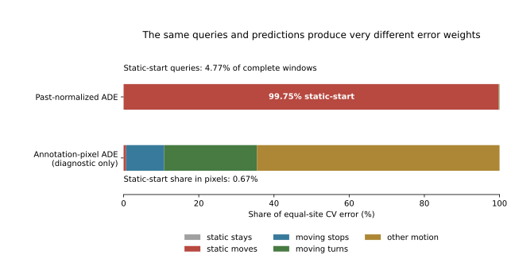

# A Source-Population Audit Exposes A Metric Conditioning Problem

## Main Finding

The registered past-normalized error gives static-start annotation windows
almost all the weight. It divides their displacement by a past-only numerical
floor of 0.001 annotation pixels. This is legal with respect to future leakage,
but it changes the practical prediction problem into an almost exclusive
static-start task. It is not evidence that all other motion has no learnable
structure, or that changing the metric would make a neural model successful.

This is a fresh aggregate audit of cached, hash-verified source inputs, followed
by raw index/geometry checks. No new training, predictions, threshold search,
primary-metric change or deployment occurs. The full research goal is unmet.

## Population And Results

The four previously explored source sites contain 175,756 past-eligible queries
from 33 recordings: 143,918 complete, 29,039 partial and 2,799 absent future
labels. This is broader than the old 15,430 stationary/complete subset from 29
recordings. All queries remain indexed. Partial/absent futures are unknown for
retrospective event labeling; they are not stationary negatives. Supported masked
ADE and complete-future ADE are separately reported.

There are 20,364 exactly static observed histories. Among complete labels,
8,566 stay exactly static and 6,864 have some future annotation displacement.
Those 6,864 queries are 4.77% of complete windows, from 253 scoped tracks, not
6,864 independent physical starts. They contribute **99.7481% of normalized CV
error**, versus **0.6660% of annotation-pixel CV error**. Each of the four sites
shows the same discrepancy: normalized shares 99.66-99.80%, pixel shares
0.36-1.72%. The pixel summary is descriptive within SDD, not metric calibration.

| Complete-future category | Windows | Oracle improvement over CV |
| --- | ---: | ---: |
| Static stays | 8,566 | Undefined: CV error is zero |
| Static then changes | 6,864 | 0%, apart from numerical roundoff |
| Moving then stops | 14,848 | 24.19% |
| Moving then turns | 17,676 | 21.39% |
| Other motion | 95,964 | 10.01% |

The fixed seven-baseline oracle has **15.2165%** headroom on complete moving
histories, but only **0.03835%** on all complete windows under the registered
metric. Its supported/masked headroom is similarly 0.03952%. All seven fixed
kinematic forecasts coincide at zero when all observed motion is zero. Thus a
baseline selector cannot repair the dominant static-start component by choosing
among them. This ceiling applies to this candidate family and metric, not every
possible neural predictor. Even a perfect predictor on all moving histories,
while leaving static histories unchanged, could improve this aggregate by at
most about **0.252%**. No oracle is a deployable model.

Other-site-only selection picks causal constant velocity in all four folds for
supported, complete and complete-moving cohorts. No new selector lift is claimed.
The 143,918 complete windows span 2,340 scoped tracks and 8,496 disjoint per-track
observation/prediction intervals. Tracks and intervals still share recordings
and scenes; neither number is an independent-scene sample size.

## What This Does And Does Not Explain

It explains why better movement forecasts can barely affect the overall
registered score, and why recent work repeatedly returned to static starts.
It does not retroactively repair negative matched image/motion probes, poor
direction prediction, source shift or previously observed overfitting. Those
results stand on their stated cohorts and metrics. It is also not a new
external-generalization result: main, bookstore, original validation/test and
external readouts remain closed.

Full-source training was already performed: 54 fits, 324,000 updates, 40 approved
source recordings. Its modest improvements over matched neural controls did not
beat causal CV. This audit is not a claim that only the stationary subset was
ever trained, and does not justify duplicating those fits unchanged.

## Scientific Decision, Not An Automatic Patch

The existing primary metric is frozen and has **not** been silently replaced.
A material decision has been requested: use native-coordinate ADE/FDE separately
within each dataset and a prespecified equal-scene relative-baseline summary,
while retaining the old metric as a complete diagnostic. No success can be
claimed from changing the denominator. The proposal is pending user decision;
new comparisons must be registered and rerun with all negative results retained.
No static windows should be discarded to improve a score.

The distinction is consistent with the original trajectory metric definition:
ADE averages Euclidean displacement over predicted steps, rather than dividing
each query by its own possibly zero past motion. The original ETH/UCY protocol
also has explicit world-coordinate and sampling assumptions that this project's
SDD raw-frame data have not established. Matching the number of observed and
predicted steps alone does not reproduce that benchmark.
[Social GAN, original CVPR paper, section 4](https://openaccess.thecvf.com/content_cvpr_2018/papers/Gupta_Social_GAN_Socially_CVPR_2018_paper.pdf).

## Verification And Limitations

All 198 loaded source arrays pass their original hashes. An independent reducer
recomputes 1,230,292 baseline/query ADE and FDE pairs. Rebuilding the raw past-only
index matches all 175,756 keys; 256 selected geometry/label queries replay exactly.
Future-array poisoning leaves inputs unchanged at one query per recording, 33
checks. An exact completed rerun reproduces all saved row arrays and aggregates.
These are pipeline checks, not independent experimental confirmation.

The first audit attempt stopped before writing outputs because it incorrectly
carried over the stationary subset's 29-recording count; the full four-site
manifest has 33. Its scale-floor detector also initially overlooked float32
serialization into a float64 container. Both were corrected before the completed
audit; the latter has a regression test. No rows were removed or result overwritten.

Category labels describe cached annotations, not verified behavioral events.
Pixel coordinates and raw annotation frames remain uncalibrated. Offline
interpolated annotations are not a sensor-as-of stream. The study has no new
independent calibration or confirmation sites, no new trained model, and no
Stage5C, SMC, true-3D or foundation result.

[Full tables](complete_results.md) | [Audit](audit.json) | [Verification](verification.json)
