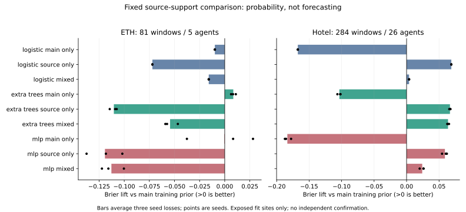

# More Source Labels Do Not Establish Transferable Start Information

## What Was Tested

This fixed experiment asks whether SDD source supervision repairs the stationary
start-information deficit without changing the main forecasting objective.
There are 45 fresh classifier fits: 15 logistic,15 ExtraTrees and15 small Torch
MLPs. Main-only,source-only and half-main/half-source training are compared at
seeds17/29/43. Source-only models are shared across both held-site directions:
54 prediction cells do not mean54 independent models.

The answer is negative for this registered geometry representation. Every
source-only and mixed arm improves Hotel Brier over the opposite-main-site prior,
but every such arm degrades ETH and its matched main-only classifier. No arm
improves both directions. This is not a forecast, safety-policy or deployment gain.

## Data and Label Support

| Population | Stationary windows with complete labels | Agent IDs | Sites / recordings | Positive fraction |
| --- | ---: | ---: | --- | ---: |
| Main ETH fit role | 81 | 5 | 1 / 1 | 72.84% |
| Main Hotel fit role | 284 | 26 | 1 / 1 | 45.42% |
| Approved SDD training source | 22,374 | 726 | 5 / 36 | 44.87% |

SDD has28,834 past-stationary queries in the unchanged229,333-query source.
The6,460 with incomplete twelve-step labels are counted as unscored, not treated
as negative starts. The main forecasting population remains11,966. Zara has no
exactly-stationary fit queries: **not_run**, not another successful domain.

Membership uses only eight past positions. A positive label means any later
annotated coordinate change, not verified intention or meaningful bodily motion.
The source's10,039 exact-nonzero positive windows must not be confused with the
earlier, different half-box-displacement census of244 windows/58tracks.
Source stride12 gives+144raw annotation frames across12steps; the ETH/UCY native
grids differ. No physical-duration, meter or pixel-to-local-unit equivalence is
verified. Complete-label supervision can select a different support population;
it does not change inference membership or turn missing labels into truth.

## Fixed Three-Seed Results

Brier lift is an **absolute squared-probability-score difference**, not percent
improvement, ADE or FDE. Positive is better. All values are seed-mean row scores.

| Model | Main-only ETH / Hotel | Source-only ETH / Hotel | Mixed ETH / Hotel |
| --- | --- | --- | --- |
| Logistic | -0.00982 / -0.16738 | -0.07197 / +0.06887 | -0.01591 / +0.00385 |
| ExtraTrees | +0.00852 / -0.10345 | -0.11032 / +0.06676 | -0.05437 / +0.06379 |
| MLP | -0.00038 / -0.18352 | -0.11919 / +0.05899 | -0.11276 / +0.02407 |

Source/mixed Hotel AUROC ranges0.4966-0.5797; source-only ETH AUROC ranges
0.3454-0.5162. Main-only MLP ETH AUROC0.7373 coexists with negative mean Brier:
ranking and calibrated probability accuracy are different requirements.
The [full table](results.md), [all cells](fit_metrics.csv) and
[contrasts](contrasts.md) retain every arm and seed, without selecting a winner.

## Why Hotel Improvement Is Not the Missing Mechanism

The source positive fraction44.87% is already close to Hotel45.42%, whereas
the opposite-main-site smoothed reference is72.29%. A constant source-prior
prediction has Hotel Brier0.24794. **Every source-only and mixed family is worse
than this constant prediction on Hotel**, with additional Brier error0.00328-0.06831.
This constant-prior contrast is a post hoc analytic diagnostic, not a fitted or
selected deployment policy.

For held label rate r, mean prediction m, prediction variance V and prediction/
label covariance C, lift over constant q is exactly:

`(q-r)^2 - (m-r)^2 + 2*C - V`.

The first two terms describe mean-probability shift; the last two describe the
net value of within-site varying predictions under Brier score. This is a
descriptive identity using held labels, not an inference-time recalibration.

| Hotel arm | Mean-shift contribution | Within-site contribution | Total lift |
| --- | ---: | ---: | ---: |
| Source logistic | +0.06919 | -0.00032 | +0.06887 |
| Source trees | +0.06888 | -0.00212 | +0.06676 |
| Source MLP | +0.06606 | -0.00707 | +0.05899 |
| Mixed logistic | +0.03700 | -0.03316 | +0.00385 |
| Mixed trees | +0.07218 | -0.00838 | +0.06379 |
| Mixed MLP | +0.05553 | -0.03145 | +0.02407 |

Every source/mixed family has a negative seed-mean within-site contribution in
both held sites. This does not prove features contain zero mutual information:
poor calibration, model misspecification and finite support can all produce it.
It does show that these fitted probability variations are not a supported reason
to replace a safe trajectory baseline. Nothing here measures departure direction,
future displacement quality or joint intervention benefit.

## Failure Taxonomy

1. **Prior shift is a real confound.** Hotel probability improvements largely
   correct a mismatched training prevalence; they do not demonstrate useful
   sample-specific switching. The decomposition isolates that fact algebraically,
   without a claim about the causal origin of domain shift.
2. **Flexible models can fit exposed training histories without transfer.**
   Main-only MLP training Brier is0.000000165-0.00785, while Hotel Brier worsens.
   Source trees reach training Brier about0.062 yet lose across domains. More
   accurate in-training classification alone is insufficient.
3. **This input representation remains limited.** The476 past-only features
   encode trajectory/neighbor geometry and causal rollouts, not visual body
   state, intention or human goals. Exact-static ego motion is uninformative by
   construction. Unit/rotation conditioning does not establish semantic alignment.
4. **Source size is not independent target support.** Hundreds of source IDs do
   not add held ETH/Hotel scenes. Exact box-center changes, coordinate resolution
   and native horizons are not semantically calibrated across sources.
5. **Budget and architecture are finite.** Each MLP has1,000 fixed BCE updates;
   source-only training Brier remains about0.232. Undertraining or an inadequate
   representation is not ruled out. The tree counterexample and main overfit
   prevent treating longer generic training as an already justified solution.

## Uncertainty and Research Boundary

The2,000-draw agent bootstrap conditions on fitted models and exposed sites.
It averages seed losses, not probabilities. Agent-balanced intervals differ
from row-weighted primary probe scores and cannot be substituted to rescue a
failed direction. All source/mixed Hotel intervals versus the main prior cross
zero under this agent weighting. Some improvements over a poor main-only Hotel
model have positive intervals, but do not show bidirectional transfer or beat the
constant-source-prior diagnostic. Contemporaneous agents and overlapping windows
are dependent; logistic seeds repeat the same solution. No independent-scene
confidence, multiple-comparison-adjusted success or risk guarantee is claimed.

The main eight-observed/twelve-predicted task, past-normalized equal-site ADE,
all roles and source admission remain unchanged. No development, calibration or
confirmation data were opened. No thresholds, probability calibration, residual,
joint policy, Stage5C or SMC were fitted or enabled. Historical contaminated
Stage scores remain exploratory; this does not reinstate them as clean results.

## Verified Execution and Next Action

`fresh_run`:45 fits,15,000 Torch updates (100 pilot+14,900 continuation), paired
scoring, loss traces and conditional bootstrap. Summed fit time684.70seconds;
full invocation11.61minutes. This is a finite classifier information study, not
full-scale world-model training. The long part is source-supported tree fitting.

`cached_verified`: approved input/producer hashes and source roles, then45 exact
prediction replays. Completed resume preserves166 immutable artifacts and the
report hash, performs zero fits/updates. Seventeen focused tests pass; the full
legacy suite was not rerun. Weights, raw data and caches remain private.

The next discriminating experiment should test observable state-change cues,
not another exposed-scene threshold sweep. A matched source-supported visual
start probe can compare geometry+coverage-mask against the same model with past
RGB, using the already admitted source, constant-prior controls and unchanged
roles. It must report whether any benefit exceeds the prevalence shift and is
consistent across directions before informing a forecast head. Source label
resolution/horizon limitations and small target support remain explicit; a
positive fit-only probe would still need independent confirmation.

No model is promoted. The research goal remains active and unmet. See
[reproduction](reproducibility.md), [verification](verification.json),
[replay](replay.json), [failure gates](gates.md) and [raw aggregate analysis](analysis.json).
