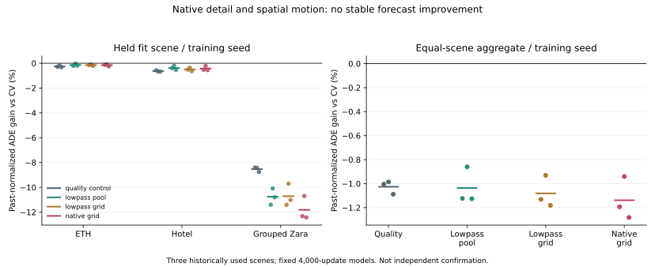

# Native Detail and Spatial Motion: Negative Fit-Only Result

## Experiment and Provenance

`fresh_run`: four matched observation variants, three seeds and three held
physical-scene fit folds, all 11,966 registered eight-observation/twelve-target
windows retained. The full matrix completes 36 real Torch fits, each with 4,000
optimizer updates: 144,000 updates and 174.57 seconds summed fitting time.
The 100-update pilot resumes into the first fit and is not counted twice.
Cached feature MLP training is fast; this is not full end-to-end video training.

The registration was committed as `b0a540ca` before feature extraction and model
outcomes. Original 96x96 past crops are compared with their exact 32x32 averages
upsampled to 96x96. Both views use the same fixed Farneback estimator. The
controlled contrasts are spatial grid versus central pooling at low resolution,
then native detail versus lowpass at the same grid. All variants have 1,260
inputs and share both views' coverage/consistency features; the quality control
is therefore not pure trajectory-only geometry.

30,013 source crops reduce exactly to the previously registered image/coverage
cache. The extraction uses 16,106 unique observed-frame pairs and takes 133.13
seconds. The local array footprint is 1,177,292,552 bytes. Missing-image Zara03's
180 windows stay in the population. No new source or sealed role is admitted.
Future labels are opened only for fitting/evaluation, not feature extraction.

The source observation definition remains offline annotated forecasting, with
retrospective interpolation disclosed. Image motion is not verified ground-plane
body motion. The fixed optical-flow algorithm is an established image-motion
estimator, not a method novelty claim. [OpenCV documentation](https://docs.opencv.org/4.13.0/d4/dee/tutorial_optical_flow.html).

## Results

Primary remains past-normalized ADE with equal physical-scene/seed aggregation.
CV is training-selected strongest in every fold. Negative gain means worse.

| Input variant | Gain vs CV (%) | Gain vs quality (%) | Positive held fits | Easy gate passes | Binary CV/candidate oracle (%) |
| --- | ---: | ---: | ---: | ---: | ---: |
| Quality control | -1.0260 | 0.0000 | 0/9 | 0/9 | 0.3255 |
| Lowpass central pool | -1.0365 | -0.0103 | 0/9 | 0/9 | 0.3453 |
| Lowpass spatial grid | -1.0810 | -0.0544 | 0/9 | 0/9 | 0.3393 |
| Native spatial grid | -1.1385 | -0.1114 | 0/9 | 0/9 | 0.3281 |

Native grid versus lowpass grid is -0.05693%, with exploratory paired-scene
95% interval [-0.99781%, 0.07018%]. Each of the three seed aggregate contrasts
is negative; Hotel improves slightly while ETH and Zara worsen. The interval
crosses zero, so this is no stable benefit from retaining native detail.
Grid pooling also fails to improve the overall lowpass pooled control.

All 36 easy gates fail: relative degradation 198.02%--11,809.43%; absolute
normalized easy harm 0.02632--0.30902. Small denominators make percentages large,
but absolute harm is also positive. These are uncontrolled forecasts, not an
evaluated fallback deployment. No threshold search hides the damage.

Training primary gains reach 2.236%, but every held fit remains negative. Every
variant/recording native-coordinate seed-mean contrast is also negative; these
diagnostics are kept separate by recording and never pooled across unverified
units. Even retrospective perfect binary switching between each fixed neural
candidate and CV captures only 0.325%--0.345% overall. This oracle uses labels
only as a diagnosis; it is not a deployable selector or general oracle bound on
other predictors.

## Failure Taxonomy

1. **Resolution alone is insufficient.** Native and lowpass vectors differ and
   the synthetic sparse-motion fixture validates that grids can retain motion
   erased by a median. The real forecasting contrast nevertheless fails. The
   synthetic mechanism is not evidence of useful real person localization.
2. **Independent state-change support remains small.** Exactly stationary
   histories cover five ETH and 26 Hotel source IDs, 81 and 284 overlapping
   windows. Zara contributes none. Neither this feature repair nor three seeds
   creates additional independent start/stop scenes.
3. **Observed feature support shifts.** At least one native motion feature
   exceeds the fixed training-normalized +/-10 range for 100% of stationary ETH
   rows and 90.14% of stationary Hotel rows. Lowpass grid gives 95.06% and 88.38%.
   These are any-column diagnostics, not a causal proof that clipping alone
   explains the failure. The native/lowpass comparison has matched dimensionality.
4. **Moving cases also fail.** In this row/log study stationary Hotel histories
   account for only 22.20%--61.66% of positive harm across all variants/seeds,
   rather than the near-total harm observed in earlier ADE-loss arms. The
   earlier loss diagnosis must not be copied as this experiment's explanation.
5. **Tiny candidate headroom limits more gate tuning.** Better intervention
   control cannot manufacture good trajectories when both candidates miss the
   future. More thresholds on these same fixed predictions are low priority.

## Verification and Scope

`cached_verified`: all 36 checkpoint inference replays match saved predictions
exactly. A completed-run resume performs zero new updates and preserves weights
and the main report byte-for-byte. Every checkpoint has step4,000, 41 logged
loss observations, nonempty optimizer state and nonzero finite learned output
weights. Runtime is arm64 Python3.11.1, loaded Torch2.12.0, CPU4/interop1/workers0.
17 focused tests pass; the unrelated full legacy suite was not rerun.

The initial extraction loaded separate PyAV/OpenCV FFmpeg builds and printed
duplicate AVFoundation class warnings. It completed, not hung. Independent
native decode was subsequently isolated in a no-OpenCV subprocess: 32 sampled
native crops/masks match exactly; 64 fixed flow pairs also match exactly. This
is sampled second-pass verification, not a second full decode. All 30,013
lowpass reductions were checked during the full first extraction.

Three seeds and 2,000 paired scene-bootstrap draws are available. There are only
three historically explored physical-scene clusters with shared training folds;
these intervals are exploratory, not independent confirmation or a safety
coverage guarantee. Development, calibration and confirmation remain closed.
No new deployment, Stage5C/SMC, metric/seconds, true3D or foundation claim.

## Next Action

The next high-value question is whether more independent, matched start/stop
observations make a transferable candidate possible. A metadata-only local
inventory found 60 SDD video files, but that does not certify their completeness,
annotation alignment or admissibility as new training data. Source admission
remains an explicit scientific decision; no SDD model is trained in this repair.

Do not replace the primary metric, reopen sealed labels, repeat generic gate
sweeps, or describe the historical Stage26/37 scores as independent validation.
The proposed contribution remains baseline-relative scene-level intervention;
it still lacks useful candidate forecasts and independent risk evidence under
the repaired protocol. This result is **not submission-ready**.

Artifacts: [registered design](../spatial_motion_decision.md), [all fits](report.json),
[input support](input_diagnosis.json), [error decomposition](failure_diagnosis.json),
[checkpoint verification](verification.json), [media inventory](../sdd_media_inventory/report.md).
