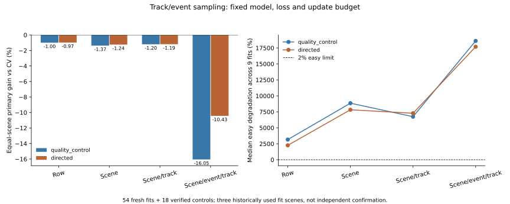

# Track/Event Sampling Does Not Repair Forecasting

## Result

The fixed sampling hypothesis fails in this experiment. Neither balancing source
tracks nor balancing supervised state-change proxies beats the causal CV
baseline. Event balancing increases error substantially. These models are not
promoted, and this study does not establish a new M3W contribution.

| Sampler | Quality-control gain vs CV (%) | Directed image-motion gain vs CV (%) |
| --- | ---: | ---: |
| Row uniform, reused control | -0.9958 | -0.9724 |
| Scene uniform | -1.3725 | -1.2393 |
| Scene/track uniform | -1.1993 | -1.1877 |
| Scene/event/track uniform | -16.0531 | -10.4303 |

Zero of 54 fresh fits beats CV; zero passes the 2% easy-preservation criterion.
The 18 old controls also fail both checks. CV is the training-selected strongest
candidate in every fold, not a baseline selected using held outcomes.

For directed features, the event-balanced gain has an exploratory scene interval
of [-23.8624%, -0.4492%]. Seed means are -11.0392%, -9.7077%, -10.5440%.
ETH, Hotel and grouped Zara means are all negative. Three historically used fit
scenes and 2,000 resamples do not constitute independent confirmation.

## What Ran

`fresh_run`: 54 real native-arm64 Torch fits, 4,000 updates each, 216,000 total
updates. The first fit ran 200 updates, resumed to 400 without held evaluation,
then resumed to 4,000. The full invocation therefore adds 215,600 updates; the
other 400 belong to the two real pilot invocations, not extra training budget.
Summed fresh fitting time is 185.5236 seconds. This is a cached-feature MLP
experiment, not a large multimodal representation training run.

`cached_verified`: 18 observed-motion-v2 row-log controls, original feature
arrays and all input/parent bindings. Each old checkpoint reproduces its original
held predictions exactly before inclusion. No control is labeled newly trained.

The approved 11,966 windows, three physical-scene folds, seeds 17/29/43, eight
observations, twelve native future annotation steps, CV skip, optimizer, log-ADE
loss and fixed-end checkpoint remain unchanged. Quality-control and directed
features have matched dimensions. Equal-scene past-normalized mean ADE remains
the primary endpoint; log loss is the training surrogate, not a renamed endpoint.

Events use train future labels as ordinary supervised sampling information.
Models receive neither event labels, future positions nor source track IDs.
Held event labels are read after training for descriptive slices only. No
development, calibration or confirmation role is opened. Retrospective source
annotations remain disclosed; this is not strict sensor-as-of validation.

## Failure Mechanism

1. **Exposure changes, information does not.** When Hotel is held out, only 59
   training windows describe exactly-static histories followed by movement.
   Row-uniform sampling gives these 0.5479% of training mass; event balancing
   raises that to 10%. At seed 17 they are drawn 25,527 times. No new scene or
   independent movement onset is added. Zara has no exact-static support.
2. **Fitting a rare category does not transfer its direction.** Event-balanced
   training primary gains reach 4.07% for quality control and 2.88% for directed
   features, yet all held models remain worse than CV. Directed static-to-move
   held gain worsens from -0.0057% to -0.5650%. This supports a generalization
   failure, not a claim of an information-theoretic impossibility.
3. **False motion becomes more costly.** For static histories that remain static,
   CV error is zero. The directed model's normalized absolute ADE increases from
   0.02324 with row sampling to 3.90919 with event sampling. A percentage gain
   against zero is undefined. These values use the fixed small past-scale floor;
   they are not meters or physical displacement claims.
4. **Easy damage is not hidden by the mean.** Directed event-balanced easy
   degradation spans 606.86% to 318,800.15% across nine scene/seed fits; normalized
   easy absolute harm spans 0.080648 to 5.728622. Quality-control event balancing
   reaches 680,141.53%. Tiny CV easy errors amplify percentage ratios, which is
   why the absolute harms and all fold metrics are also retained.
5. **Subsets do not rescue the model.** Directed row-control stopping gain is
   +4.2460%; event balancing changes it to -2.3895%. Turn harm is reduced from
   -0.1924% to -0.0420%, but still does not beat CV. Other-motion gain deteriorates
   from -16.50% to -32.23%. None is a deployable overall improvement.

There are 188 overlapping static-to-move windows from 24 recording-local IDs,
279 stop windows from 30 IDs, and 1,351 turn windows from 145 IDs. IDs can overlap
categories; neither windows nor these IDs are certified independent events.
Native-coordinate diagnostics remain per-recording and are not pooled across
datasets with unverified units.



## Verification

- Registration committed and pushed as `f905dcef` before real fitting.
- All 72 original/new checkpoint inference replays match saved predictions and
  held-row alignment exactly. No nonfinite forecast was found.
- Completed resume performs zero optimizer updates. All 72 checkpoint hashes and
  the main report remain unchanged.
- 23 focused tests pass: sampler hierarchy, held-label mutation isolation,
  exact old/new row-training equivalence, synthetic resume and inherited model,
  objective and observed-motion checks. The full legacy suite was not rerun.
- Logs, PID-bearing heartbeats, optimizer/RNG states and private checkpoints are
  retained locally. No raw/cache/weight files are committed.
- Plot generation used a temporary font cache after a permissions warning.
  An auxiliary locale-sensitive hash command was retried under `LC_ALL=C`.
  Neither issue interrupted training or changed scientific outputs.

## Decision and Next Step

Do not deploy these fits or add another sampler/threshold sweep to the same
exposed folds. Sampling balance alone is insufficient under these fixed inputs,
model, loss and budget. The result does not rule out improved state/intent
representations or genuinely broader independent training support.

The next defensible data-dependent step is separately registered auxiliary
representation/state-change training with independent scene support, followed by
a matched no-auxiliary control. SDD source correspondence and support have been
audited, but its auxiliary training role and sampling admission remain pending;
this experiment does not silently authorize them. The approved primary and
sealed roles remain untouched. No physical-seconds, metric, true-3D, foundation,
submission-readiness, Stage5C or SMC claim follows.

Reproduce with the arm64 environment:

```bash
.venv-pytorch/bin/python scripts/run_m3w_track_event_sampling.py --registration configs/m3w_track_event_sampling.json
.venv-pytorch/bin/python scripts/run_m3w_track_event_sampling.py --registration configs/m3w_track_event_sampling.json --replay
.venv-pytorch/bin/python scripts/analyze_m3w_track_event_sampling.py
.venv-pytorch/bin/python -m pytest tests/test_m3w_track_event_sampling.py tests/test_m3w_objective_alignment.py tests/test_m3w_observed_motion.py tests/test_m3w_offline_visual_forecast.py -q
```

The commands require local hash-bound source caches and controls; a public clone
alone does not contain restricted/large data or private weights. The first command
resumes compatible unfinished fits or verifies already-complete artifacts.

[Fixed experiment](../track_event_sampling_decision.md), [all metrics](report.json),
[descriptive slices](diagnostics.md), [exact replay](replay.json),
[verification receipt](verification.json).
